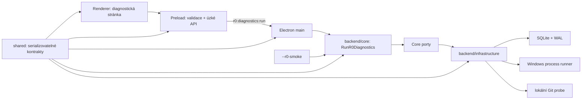

# Hranice architektury R0

Desktop tvoří frontend a bezpečnostně omezený Electron shell. Renderer nemá Node API a přes preload dostává jen validovanou diagnostickou operaci. `backend/core` obsahuje pravidla a orchestraci, zatímco `backend/infrastructure` provádí konkrétní práci s OS, SQLite a Gitem přes core porty. `shared` obsahuje pouze serializovatelné zprávy, schémata a typy. `test-support` je výhradně testovací workspace a produkční kód jej nesmí importovat.

Interaktivní IPC i headless `--r0-smoke` skládají stejnou instanci `RunR0Diagnostics`; liší se pouze vstupní adaptér.
