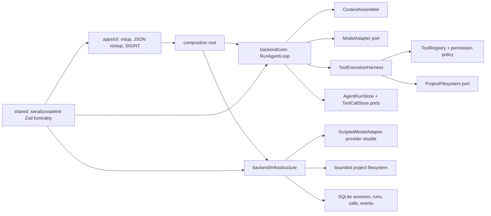

# Hranice architektury R1

R1 je interní, deterministický a pouze čtecí důkaz agentní smyčky. Není to
produktové UI ani samostatný produktový CLI. Jeho CLI je tenký vstupní adaptér
pro stejnou core službu, kterou budou později používat další vstupy.

`backend/core` vlastní pravidla smyčky, stavové přechody, validaci tool callu,
rozhodnutí o oprávnění a kanonické auditní události. `backend/infrastructure`
realizuje jeho porty nad SQLite a lokálním souborovým systémem. Pouze
`apps/cli/src/composition-root.ts` smí importovat infrastructure; CLI vstup
nesmí znát SQLite, filesystem handler ani pravidla smyčky. `shared` obsahuje
jen přenositelné kontrakty. `tests/support` je výlučně testovací a produkční
kód jej neimportuje.

## Úspěšná stopa

Pro scénář `read-search-summary` core vytvoří běh, sestaví explicitní kontext
`README.md`, vyžádá první modelový krok a přijme `text.search@1`. Harness
zapíše přijetí, validaci, automatické povolení pravidlem
`R1_SAFE_READ_WITHIN_PROJECT`, zařazení, spuštění a úspěch. Další krok požádá
o `file.read@1` a projde stejným životním cyklem. Třetí krok vrátí pevný český
souhrn; core zapíše dokončení s `verification.status = not_applicable` a
`reason = R1_READ_ONLY_RUN`.

| Vlastník | Odpovědnost |
| --- | --- |
| CLI | Validace argumentů, composition root, stdout/stderr, SIGINT |
| Core | Agentní smyčka, kontext, registry, politika, harness, audit |
| Infrastructure | SQLite, realpath-bounded čtení/hledání, scripted adapter |
| Shared | Zod schémata a serializovatelné kontrakty |
| Test support | Fixture a testovní pomocné prostředky |

| Uloženo v SQLite | Jen v paměti běhu |
| --- | --- |
| Session, agentní stav, tool call, event metadata a bezpečný výsledek | Sestavený obsah explicitních referencí |
| Relativní cesta, hash, délka, rozhodnutí oprávnění a bezpečný důvod | Předchozí normalizované odpovědi modelu a tool resulty pro další tah |
| Adapter/model ID, počítadlo kroků a terminální chyba | AbortSignal a aktivní stream/handler |

Event log neukládá plný obsah zdrojových souborů, osobní absolutní cesty,
hodnoty prostředí ani tajemství. `ScriptedModelAdapter` je provider double:
řízená síťově nezávislá náhrada poskytovatele pro opakovatelné testy, ne
ověření reálného modelu.

## Výslovná hranice R1 a předání R2

Dokončená R1 relace pouze znamená, že interní read-only harness dokončil svůj
scénář. Není to splnění celého AC-O1-02/03 ani verifikace změny kódu. R1
neimplementuje ani nenaznačuje zápis, shell, diff, safe return, skutečného
providera nebo produktové UI. R2 rozšíří tentýž orchestrátor a harness o
řízený zápis, expected hash, omezený shell a testy, diff, bezpečný návrat,
skutečné čekající oprávnění a důkaz verifikace změny; nesmí vytvořit druhou
agentní smyčku nebo obejít R1 audit.
