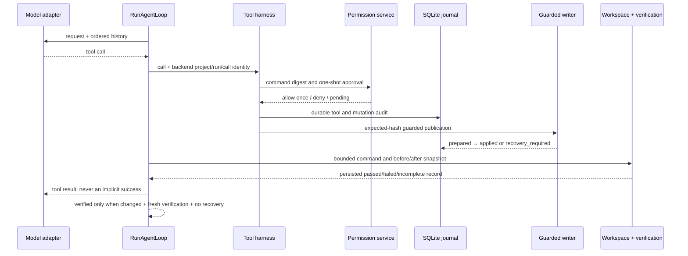

# R2 – životní cyklus řízené změny

R2 je headless backendový průchod `context → model → tool harness → změna →
ověření → diff/revert`. `RunAgentLoop.executeR2` je jediný orchestrátor.
Renderer ani CLI nemají přímý přístup k Node API; CLI pouze volá composition
root a serializuje validovaný výsledek.

Souborový zápis je omezen na existující necitlivý UTF-8 textový soubor. Každý
patch má očekávaný SHA-256 hash, durable intent a obsahové blob úložiště.
Windows writer drží kanonický cíl a procesní vrstvu; nejistý publish se
neopakuje automaticky. Recovery klasifikuje pouze skutečné bytes jako
`not_applied`, `applied` nebo `conflicted`.

Ověření je pravdivé jen při úspěšném exit code, prokázaném ukončení stromu,
úplném nezměněném snapshotu a aktuální revizi/fingerprintu. Git baseline je
uložen odděleně; vlastní diff a revert fungují i mimo Git. R2 shell není
bezpečnostní sandbox a provider eval/live gate zůstávají samostatné brány.
