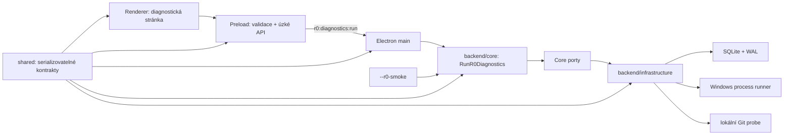

# R0 – technické základy Implementation Plan

> **For agentic workers:** REQUIRED SUB-SKILL: Use superpowers:subagent-driven-development (recommended) or superpowers:executing-plans to implement this plan task-by-task. Steps use checkbox (`- [ ]`) syntax for tracking.

**Goal:** Vytvořit reprodukovatelný Windows základ Codrynu, který v Node testech, minimální Electron aplikaci i zabaleném smoke režimu pravdivě ověří SQLite, procesní runner a lokální Git bez sítě.

**Architecture:** npm monorepo oddělí Electron shell v `apps/desktop`, čistá pravidla a porty v `backend/core`, konkrétní adaptéry v `backend/infrastructure`, serializovatelné kontrakty v `shared` a testovací pomůcky v `tests/support`. Jediná aplikační služba `RunR0Diagnostics` bude složena přes porty; renderer ji smí volat pouze přes validovaný preload a jedno úzké IPC. SQLite je jediný zdroj trvalého stavu a všechny externí procesy jdou přes jeden Windows runner.

**Tech Stack:** Windows 11 x64, Node.js 24.19.0, npm 11.x, Electron 43.4.0, Electron Forge 7.11.2, Webpack 5.109.2, TypeScript 6.0.3, Zod 4.4.3, Vitest 4.1.7, ESLint 9.39.5, dependency-cruiser 18.1.0 a vestavěné `node:sqlite`.

**Spec:** `docs/superpowers/specs/2026-08-17-r0-technicke-zaklady-design.md`

## Global Constraints

- Implementovat úkoly v uvedeném pořadí. Každý úkol končí zelenými lokálními kontrolami a samostatným commitem.
- Před každou produkční změnou nejprve přidat nebo upravit test, spustit jej a ověřit očekávaný neúspěch. Teprve potom přidat nejmenší implementaci.
- Aktuální počítač byl při psaní plánu na Node `v22.20.0`. Implementace nezačne, dokud `node --version` nevrátí přesně `v24.19.0`; změna systémového Node vyžaduje souhlas uživatele nebo jeho version manager.
- Používat pouze npm a verzovat `package-lock.json`. Nepřidávat pnpm, Yarn, React, ORM, Electron browser-mode testy ani síťové Git fixture.
- Neimplementovat chat, LLM adapter, agentní smyčku, editaci projektu, obecný shell tool, oprávnění, návrat změn, účet/cloud, MCP, skills ani pluginy; tyto oblasti začínají až v navazujících fázích.
- `backend/core` nesmí importovat Electron, `node:sqlite`, `node:child_process`, souborový systém ani Git implementaci. `shared` smí obsahovat pouze serializovatelné typy a validaci.
- Renderer nesmí importovat backend. Přístup je pouze `renderer -> preload -> r0:diagnostics:run -> main -> RunR0Diagnostics`.
- `contextIsolation: true`, `nodeIntegration: false`, `sandbox: true`; žádné obecné IPC typu `execute`, `shell` nebo `send`.
- Procesy vždy spouštět s `shell: false`, `windowsHide: true`, explicitním `cwd`, polem argumentů, timeoutem, limitem výstupu a explicitním prostředím.
- Nikdy nelogovat tajemství ani plné credential hodnoty. Git credential kontrola pouze kategorizuje konfiguraci a nikdy nevolá `git credential fill`.
- R0 ukončení stromu přes `taskkill.exe /PID <pid> /T /F` je ověřovaný Windows spike, nikoli bezpečnostní sandbox.
- Zachovat nesouvisející uživatelské změny a necommitovat adresář `Dokumentace příklady/`.

## Target File Map

```text
Codryn/
├─ .gitignore
├─ .nvmrc
├─ .npmrc
├─ package.json
├─ package-lock.json
├─ tsconfig.base.json
├─ eslint.config.mjs
├─ vitest.config.ts
├─ dependency-cruiser.config.mjs
├─ scripts/
│  ├─ check-runtime.mjs
│  ├─ verify-packaged-r0.mjs
│  └─ verify-r0.mjs
├─ shared/
│  ├─ package.json
│  ├─ tsconfig.json
│  ├─ src/{ids,json-value,event-envelope,r0-diagnostics,ipc,index}.ts
│  └─ test/{event-envelope,r0-diagnostics,ipc}.test.ts
├─ backend/
│  ├─ core/
│  │  ├─ package.json
│  │  ├─ tsconfig.json
│  │  ├─ src/diagnostics/{model,ports,run-r0-diagnostics}.ts
│  │  ├─ src/state/{transition,agent-run,tool-call,permission-request,change-set,git-operation}.ts
│  │  ├─ src/index.ts
│  │  └─ test/{run-r0-diagnostics,state-machines}.test.ts
│  └─ infrastructure/
│     ├─ package.json
│     ├─ tsconfig.json
│     ├─ src/persistence/{migrations,open-database,run-migrations,sqlite-session-repository,sqlite-event-store,sqlite-diagnostics}.ts
│     ├─ src/process/{bounded-output,windows-process-runner}.ts
│     ├─ src/git/{credential-helper-category,local-git-probe}.ts
│     ├─ src/logging/{redact,jsonl-diagnostic-logger}.ts
│     ├─ src/system/{system-clock,uuid-generator}.ts
│     ├─ src/create-r0-infrastructure.ts
│     ├─ src/index.ts
│     └─ test/{sqlite,process-runner,git-probe,logger}.test.ts
├─ tests/
│  ├─ support/
│  │  ├─ package.json
│  │  ├─ tsconfig.json
│  │  ├─ src/{eventually,temp-directory,index}.ts
│  │  └─ fixtures/process/{emit-output,exit-nonzero,large-output,spawn-child-tree}.ps1
│  ├─ architecture/dependency-rules.test.ts
│  └─ packaged/r0-smoke.test.ts
├─ apps/desktop/
│  ├─ package.json
│  ├─ tsconfig.json
│  ├─ forge.config.ts
│  ├─ webpack.rules.ts
│  ├─ webpack.main.config.ts
│  ├─ webpack.renderer.config.ts
│  ├─ src/
│  │  ├─ forge.env.d.ts
│  │  ├─ main.ts
│  │  ├─ composition-root.ts
│  │  ├─ preload.ts
│  │  ├─ ipc/{r0-handler,register-r0-handler}.ts
│  │  ├─ smoke/run-r0-smoke.ts
│  │  └─ renderer/{index.html,index.ts,styles.css}
│  └─ test/r0-handler.test.ts
└─ docs/
   ├─ architecture/r0-boundaries.md
   ├─ decisions/{README,0001-node-sqlite,0002-r0-windows-process-tree}.md
   └─ r0-author-checklist.md
```

---

## Task 1: Runtime gate, npm workspaces and boundary skeleton

**Files:**

- Create: `.nvmrc`
- Create: `.npmrc`
- Modify: `.gitignore`
- Create: `package.json`
- Create: `package-lock.json` (generated only by npm)
- Create: `tsconfig.base.json`
- Create: `eslint.config.mjs`
- Create: `vitest.config.ts`
- Create: `dependency-cruiser.config.mjs`
- Create: `scripts/check-runtime.mjs`
- Create: `shared/package.json`, `shared/tsconfig.json`, `shared/src/index.ts`
- Create: `backend/core/package.json`, `backend/core/tsconfig.json`, `backend/core/src/index.ts`
- Create: `backend/infrastructure/package.json`, `backend/infrastructure/tsconfig.json`, `backend/infrastructure/src/index.ts`
- Create: `tests/support/package.json`, `tests/support/tsconfig.json`, `tests/support/src/index.ts`
- Create: `apps/desktop/package.json`, `apps/desktop/tsconfig.json`
- Test: `tests/architecture/dependency-rules.test.ts`

### Step 1: Check the pinned runtime before any install

- [ ] Run:

```powershell
node --version
npm --version
```

At plan authoring this printed Node `v22.20.0`, which does not satisfy the approved baseline. If execution already prints `v24.19.0`, proceed; otherwise do not install or replace system software without user approval.

### Step 2: Add an executable runtime gate

- [ ] Create `scripts/check-runtime.mjs`:

```js
const expectedNode = '24.19.0';
const actualNode = process.versions.node;

if (actualNode !== expectedNode) {
  console.error(`R0 requires Node ${expectedNode}; current runtime is ${actualNode}.`);
  process.exit(1);
}

const npmVersion = process.env.npm_config_user_agent?.match(/npm\/(\d+\.\d+\.\d+)/)?.[1];
if (npmVersion !== undefined && !npmVersion.startsWith('11.')) {
  console.error(`R0 requires npm 11.x; current npm is ${npmVersion}.`);
  process.exit(1);
}

console.log(`Runtime OK: Node ${actualNode}, npm ${npmVersion ?? 'not invoked through npm'}.`);
```

- [ ] Run it under the current runtime:

```powershell
node scripts/check-runtime.mjs
```

Expected: exit code `1` and `R0 requires Node 24.19.0; current runtime is 22.20.0.`

- [ ] Switch to an approved Node `24.19.0` installation, then rerun:

```powershell
node --version
npm --version
node scripts/check-runtime.mjs
```

Expected: `v24.19.0`, npm `11.x`, and exit code `0`.

### Step 3: Create the root npm contract

- [ ] Add `.nvmrc`:

```text
24.19.0
```

- [ ] Add `.npmrc`:

```ini
engine-strict=true
save-exact=true
fund=false
audit=true
```

- [ ] Replace `.gitignore` with:

```gitignore
.superpowers/
node_modules/
dist/
out/
coverage/
*.log
*.sqlite
*.sqlite-shm
*.sqlite-wal
.r0-artifacts/
```

- [ ] Create root `package.json`:

```json
{
  "name": "codryn",
  "version": "0.0.0",
  "private": true,
  "workspaces": [
    "apps/*",
    "backend/*",
    "shared",
    "tests/support"
  ],
  "engines": {
    "node": "24.19.0",
    "npm": ">=11 <12"
  },
  "scripts": {
    "preinstall": "node scripts/check-runtime.mjs",
    "typecheck": "npm run typecheck --workspaces --if-present",
    "lint": "eslint apps backend shared tests scripts --max-warnings=0",
    "check:deps": "depcruise apps backend shared tests/support/src --config dependency-cruiser.config.mjs",
    "test": "vitest run",
    "test:watch": "vitest",
    "package": "npm run package --workspace @codryn/desktop",
    "make": "npm run make --workspace @codryn/desktop",
    "verify:r0": "node scripts/verify-r0.mjs"
  },
  "devDependencies": {
    "@eslint/js": "9.39.5",
    "@types/node": "24.13.3",
    "dependency-cruiser": "18.1.0",
    "eslint": "9.39.5",
    "typescript": "6.0.3",
    "typescript-eslint": "8.65.0",
    "vite": "7.3.6",
    "vitest": "4.1.7"
  }
}
```

### Step 4: Create compiler, lint and test configuration

- [ ] Create `tsconfig.base.json`:

```json
{
  "compilerOptions": {
    "target": "ES2024",
    "module": "ESNext",
    "moduleResolution": "Bundler",
    "lib": ["ES2024"],
    "strict": true,
    "noUncheckedIndexedAccess": true,
    "exactOptionalPropertyTypes": true,
    "useUnknownInCatchVariables": true,
    "isolatedModules": true,
    "verbatimModuleSyntax": true,
    "resolveJsonModule": true,
    "skipLibCheck": false,
    "noEmit": true
  }
}
```

- [ ] Create `eslint.config.mjs`:

```js
import eslint from '@eslint/js';
import tseslint from 'typescript-eslint';

export default tseslint.config(
  { ignores: ['node_modules/**', 'out/**', 'dist/**', 'coverage/**'] },
  eslint.configs.recommended,
  ...tseslint.configs.strict,
  {
    files: ['**/*.ts'],
    rules: {
      '@typescript-eslint/consistent-type-imports': 'error',
      '@typescript-eslint/no-explicit-any': 'error'
    }
  }
);
```

- [ ] Create `vitest.config.ts`:

```ts
import { defineConfig } from 'vitest/config';

export default defineConfig({
  test: {
    environment: 'node',
    include: [
      'shared/test/**/*.test.ts',
      'backend/**/test/**/*.test.ts',
      'tests/**/*.test.ts',
      'apps/**/test/**/*.test.ts'
    ],
    coverage: { enabled: false },
    testTimeout: 15_000,
    hookTimeout: 15_000
  }
});
```

- [ ] Create `dependency-cruiser.config.mjs` with explicit production boundaries:

```js
export default {
  forbidden: [
    {
      name: 'core-must-not-import-infrastructure',
      severity: 'error',
      from: { path: '^backend/core/' },
      to: { path: '^(backend/infrastructure/|apps/desktop/)' }
    },
    {
      name: 'shared-must-stay-independent',
      severity: 'error',
      from: { path: '^shared/' },
      to: { path: '^(backend/|apps/desktop/|tests/)' }
    },
    {
      name: 'renderer-must-use-preload',
      severity: 'error',
      from: { path: '^apps/desktop/src/renderer/' },
      to: { path: '^(backend/|apps/desktop/src/(composition-root|ipc|smoke))' }
    },
    {
      name: 'production-must-not-import-test-support',
      severity: 'error',
      from: { path: '^(apps/|backend/|shared/)' },
      to: { path: '^tests/support/' }
    }
  ],
  options: {
    doNotFollow: { path: 'node_modules' },
    tsConfig: { fileName: 'tsconfig.base.json' },
    enhancedResolveOptions: { exportsFields: ['exports'] },
    exclude: { path: '(node_modules|out|dist|coverage)' }
  }
};
```

### Step 5: Define all five private workspaces

- [ ] Use this shared manifest shape for `shared/package.json`:

```json
{
  "name": "@codryn/shared",
  "version": "0.0.0",
  "private": true,
  "main": "./src/index.ts",
  "types": "./src/index.ts",
  "exports": { ".": "./src/index.ts" },
  "scripts": { "typecheck": "tsc --noEmit -p tsconfig.json" },
  "dependencies": { "zod": "4.4.3" }
}
```

- [ ] Create equivalent private manifests for the remaining workspaces with these exact names and dependency directions:

```json
{
  "@codryn/core": { "dependencies": { "@codryn/shared": "0.0.0" } },
  "@codryn/infrastructure": { "dependencies": { "@codryn/core": "0.0.0", "@codryn/shared": "0.0.0" } },
  "@codryn/test-support": { "dependencies": { "@codryn/shared": "0.0.0" } },
  "@codryn/desktop": { "dependencies": { "@codryn/core": "0.0.0", "@codryn/infrastructure": "0.0.0", "@codryn/shared": "0.0.0" } }
}
```

For each manifest, expand the object into a normal `package.json` with `version: "0.0.0"`, `private: true`, source `main`/`types`/`exports`, and `typecheck: "tsc --noEmit -p tsconfig.json"`. Desktop packaging dependencies are added in Task 9.

- [ ] Create each workspace `tsconfig.json` from this base; only desktop additionally adds `"lib": ["ES2024", "DOM"]`:

```json
{
  "extends": "../../tsconfig.base.json",
  "compilerOptions": {
    "baseUrl": ".",
    "types": ["node"]
  },
  "include": ["src/**/*.ts", "test/**/*.ts"]
}
```

For `shared/tsconfig.json` and `tests/support/tsconfig.json`, the `extends` path is `../tsconfig.base.json`. Create an empty `export {};` in each `src/index.ts` so the first typecheck has real entry points.

### Step 6: Install deterministically and prove the skeleton

- [ ] Run:

```powershell
npm install
npm run typecheck
npm run lint
npm run check:deps
```

Expected: npm creates one root `package-lock.json`; all four commands exit `0`. Do not run Vitest until Step 7 has added the first real test.

### Step 7: Add the first architecture test

- [ ] Create `tests/architecture/dependency-rules.test.ts`:

```ts
import { readFile } from 'node:fs/promises';
import { describe, expect, it } from 'vitest';

const manifests = [
  ['apps/desktop/package.json', '@codryn/desktop'],
  ['backend/core/package.json', '@codryn/core'],
  ['backend/infrastructure/package.json', '@codryn/infrastructure'],
  ['shared/package.json', '@codryn/shared'],
  ['tests/support/package.json', '@codryn/test-support']
] as const;

describe('workspace boundaries', () => {
  it.each(manifests)('%s is a private workspace named %s', async (file, name) => {
    const manifest = JSON.parse(await readFile(file, 'utf8')) as {
      name: string;
      private: boolean;
    };
    expect(manifest).toMatchObject({ name, private: true });
  });
});
```

- [ ] Run:

```powershell
npm test -- tests/architecture/dependency-rules.test.ts
```

Expected: five passing cases.

### Step 8: Commit the bootstrap

- [ ] Run:

```powershell
git status --short
git add .gitignore .nvmrc .npmrc package.json package-lock.json tsconfig.base.json eslint.config.mjs vitest.config.ts dependency-cruiser.config.mjs scripts/check-runtime.mjs apps/desktop backend shared tests
git commit -m "build: bootstrap R0 npm workspaces"
```

Expected: commit contains only bootstrap files; `Dokumentace příklady/` remains untracked.

---

## Task 2: Serializable shared contracts and validated IPC envelope

**Files:**

- Create: `shared/src/ids.ts`
- Create: `shared/src/json-value.ts`
- Create: `shared/src/event-envelope.ts`
- Create: `shared/src/r0-diagnostics.ts`
- Create: `shared/src/ipc.ts`
- Modify: `shared/src/index.ts`
- Test: `shared/test/event-envelope.test.ts`
- Test: `shared/test/r0-diagnostics.test.ts`
- Test: `shared/test/ipc.test.ts`

### Step 1: Write failing contract tests

- [ ] Create tests that demand strict objects, UUIDs, ISO timestamps and JSON-only evidence:

```ts
import { describe, expect, it } from 'vitest';
import {
  eventEnvelopeSchema,
  r0DiagnosticRequestSchema,
  r0IpcResponseSchema
} from '../src/index.js';

const event = {
  eventId: '11111111-1111-4111-8111-111111111111',
  eventType: 'r0.diagnostic.started',
  eventVersion: 1,
  correlationId: '22222222-2222-4222-8222-222222222222',
  occurredAt: '2026-08-17T10:00:00.000Z',
  source: 'core',
  sessionId: '33333333-3333-4333-8333-333333333333',
  payload: { trigger: 'test' }
};

describe('shared runtime contracts', () => {
  it('accepts a valid v1 event envelope', () => {
    expect(eventEnvelopeSchema.parse(event)).toEqual(event);
  });

  it('rejects unknown fields and non-UUID request ids', () => {
    expect(() => r0DiagnosticRequestSchema.parse({
      requestId: 'not-a-uuid',
      requestedAt: event.occurredAt,
      executable: 'powershell.exe'
    })).toThrow();
  });

  it('rejects a response containing non-JSON evidence', () => {
    expect(r0IpcResponseSchema.safeParse({
      ok: true,
      report: { checks: [{ evidence: { pid: 1n } }] }
    }).success).toBe(false);
  });
});
```

Split these cases into the three named test files. Keep canonical valid request/report factories local to the tests until Task 4 adds test-support builders.

- [ ] Run:

```powershell
npm test -- shared/test
```

Expected: failure because the schemas do not exist.

### Step 2: Implement JSON and identity primitives

- [ ] Add `shared/src/json-value.ts`:

```ts
import { z } from 'zod';

export type JsonValue =
  | null
  | boolean
  | number
  | string
  | JsonValue[]
  | { [key: string]: JsonValue };

export const jsonValueSchema: z.ZodType<JsonValue> = z.lazy(() => z.union([
  z.null(),
  z.boolean(),
  z.number().finite(),
  z.string(),
  z.array(jsonValueSchema),
  z.record(z.string(), jsonValueSchema)
]));
```

- [ ] Add `shared/src/ids.ts`:

```ts
import { z } from 'zod';

export const uuidSchema = z.uuid();
export const isoTimestampSchema = z.iso.datetime({ offset: true });

export type Uuid = z.infer<typeof uuidSchema>;
export type IsoTimestamp = z.infer<typeof isoTimestampSchema>;
```

### Step 3: Implement the v1 event envelope

- [ ] Add `shared/src/event-envelope.ts`:

```ts
import { z } from 'zod';
import { isoTimestampSchema, uuidSchema } from './ids.js';
import { jsonValueSchema } from './json-value.js';

export const eventSourceSchema = z.enum([
  'core',
  'database',
  'process',
  'git',
  'desktop'
]);

export const eventEnvelopeSchema = z.object({
  eventId: uuidSchema,
  eventType: z.string().min(1),
  eventVersion: z.literal(1),
  correlationId: uuidSchema,
  occurredAt: isoTimestampSchema,
  source: eventSourceSchema,
  sessionId: uuidSchema.optional(),
  payload: jsonValueSchema
}).strict();

export type EventEnvelope = z.infer<typeof eventEnvelopeSchema>;
```

### Step 4: Implement diagnostic request, result and report schemas

- [ ] Add `shared/src/r0-diagnostics.ts` with these exact public shapes:

```ts
import { z } from 'zod';
import { isoTimestampSchema, uuidSchema } from './ids.js';
import { jsonValueSchema } from './json-value.js';

export const r0CheckStatusSchema = z.enum(['pass', 'fail', 'skipped']);
export const r0ReportStatusSchema = z.enum(['passed', 'failed']);
export const r0CheckCodeSchema = z.enum([
  'R0_OK',
  'R0_SKIPPED_DEPENDENCY',
  'R0_DB_OPEN_FAILED',
  'R0_DB_MIGRATION_FAILED',
  'R0_DB_INTEGRITY_FAILED',
  'R0_DB_BACKUP_FAILED',
  'R0_PROCESS_SPAWN_FAILED',
  'R0_PROCESS_EXIT_NONZERO',
  'R0_PROCESS_TIMED_OUT',
  'R0_PROCESS_TREE_REMAINS',
  'R0_PROCESS_OUTPUT_LIMIT',
  'R0_GIT_NOT_AVAILABLE',
  'R0_GIT_FIXTURE_FAILED',
  'R0_GIT_CREDENTIAL_UNSAFE',
  'R0_INTERNAL_ERROR'
]);

export const r0DiagnosticRequestSchema = z.object({
  requestId: uuidSchema,
  requestedAt: isoTimestampSchema
}).strict();

export const r0CheckResultSchema = z.object({
  checkId: z.string().min(1),
  status: r0CheckStatusSchema,
  code: r0CheckCodeSchema,
  message: z.string().min(1),
  startedAt: isoTimestampSchema,
  finishedAt: isoTimestampSchema,
  durationMs: z.number().int().nonnegative(),
  evidence: z.record(z.string(), jsonValueSchema)
}).strict();

export const r0DiagnosticReportSchema = z.object({
  schemaVersion: z.literal(1),
  requestId: uuidSchema,
  sessionId: uuidSchema,
  overallStatus: r0ReportStatusSchema,
  startedAt: isoTimestampSchema,
  finishedAt: isoTimestampSchema,
  durationMs: z.number().int().nonnegative(),
  checks: z.array(r0CheckResultSchema).min(1)
}).strict();

export type R0DiagnosticRequest = z.infer<typeof r0DiagnosticRequestSchema>;
export type R0CheckResult = z.infer<typeof r0CheckResultSchema>;
export type R0DiagnosticReport = z.infer<typeof r0DiagnosticReportSchema>;
```

### Step 5: Implement the sole renderer IPC contract

- [ ] Add `shared/src/ipc.ts`:

```ts
import { z } from 'zod';
import { r0DiagnosticReportSchema } from './r0-diagnostics.js';

export const R0_DIAGNOSTICS_CHANNEL = 'r0:diagnostics:run' as const;

const ipcErrorSchema = z.object({
  code: z.enum(['R0_IPC_INVALID_INPUT', 'R0_INTERNAL_ERROR']),
  message: z.string().min(1)
}).strict();

export const r0IpcResponseSchema = z.discriminatedUnion('ok', [
  z.object({ ok: z.literal(true), report: r0DiagnosticReportSchema }).strict(),
  z.object({ ok: z.literal(false), error: ipcErrorSchema }).strict()
]);

export type R0IpcResponse = z.infer<typeof r0IpcResponseSchema>;
```

- [ ] Export all modules from `shared/src/index.ts` using explicit `.js` specifiers.

### Step 6: Run the contract suite and static checks

- [ ] Run:

```powershell
npm test -- shared/test
npm run typecheck --workspace @codryn/shared
npm run lint
```

Expected: all shared tests pass; TypeScript rejects any accidental `unknown` or non-JSON evidence.

### Step 7: Commit shared contracts

- [ ] Run:

```powershell
git add shared
git commit -m "feat(shared): define R0 runtime contracts"
```

---

## Task 3: Pure state machines for later agent operations

**Files:**

- Create: `backend/core/src/state/transition.ts`
- Create: `backend/core/src/state/agent-run.ts`
- Create: `backend/core/src/state/tool-call.ts`
- Create: `backend/core/src/state/permission-request.ts`
- Create: `backend/core/src/state/change-set.ts`
- Create: `backend/core/src/state/git-operation.ts`
- Modify: `backend/core/src/index.ts`
- Test: `backend/core/test/state-machines.test.ts`

### Step 1: Write the transition matrix tests first

- [ ] Add table-driven tests covering every approved edge and representative forbidden edges:

```ts
import { describe, expect, it } from 'vitest';
import {
  transitionAgentRun,
  transitionChangeSet,
  transitionGitOperation,
  transitionPermissionRequest,
  transitionToolCall
} from '../src/index.js';

describe('R0 state machines', () => {
  it.each([
    ['idle', 'preparing_context'],
    ['preparing_context', 'waiting_for_model'],
    ['waiting_for_model', 'executing_tool'],
    ['executing_tool', 'verifying'],
    ['verifying', 'completed']
  ] as const)('allows AgentRun %s -> %s', (from, to) => {
    expect(transitionAgentRun(from, to)).toEqual({ ok: true, state: to });
  });

  it('rejects terminal AgentRun transitions without mutating state', () => {
    expect(transitionAgentRun('completed', 'executing_tool')).toEqual({
      ok: false,
      code: 'INVALID_STATE_TRANSITION',
      from: 'completed',
      to: 'executing_tool'
    });
  });

  it('keeps approval, changes and Git as independent machines', () => {
    expect(transitionPermissionRequest('pending', 'approved')).toEqual({ ok: true, state: 'approved' });
    expect(transitionChangeSet('reverting', 'conflicted')).toEqual({ ok: true, state: 'conflicted' });
    expect(transitionGitOperation('preflight', 'executing')).toEqual({ ok: true, state: 'executing' });
    expect(transitionToolCall('running', 'failed')).toEqual({ ok: true, state: 'failed' });
  });
});
```

- [ ] Run:

```powershell
npm test -- backend/core/test/state-machines.test.ts
```

Expected: failure because none of the transition functions exist.

### Step 2: Implement one reusable transition primitive

- [ ] Add `backend/core/src/state/transition.ts`:

```ts
export type TransitionResult<State extends string> =
  | { readonly ok: true; readonly state: State }
  | {
      readonly ok: false;
      readonly code: 'INVALID_STATE_TRANSITION';
      readonly from: State;
      readonly to: State;
    };

export function transition<State extends string>(
  graph: Readonly<Record<State, readonly State[]>>,
  from: State,
  to: State
): TransitionResult<State> {
  return graph[from].includes(to)
    ? { ok: true, state: to }
    : { ok: false, code: 'INVALID_STATE_TRANSITION', from, to };
}
```

This function returns a value only; it never mutates an entity or performs I/O.

### Step 3: Encode the five complete graphs

- [ ] Use these exact states and outgoing edges:

```ts
export const agentRunGraph = {
  idle: ['preparing_context'],
  preparing_context: ['waiting_for_model', 'cancelled', 'failed'],
  waiting_for_model: ['executing_tool', 'waiting_for_approval', 'verifying', 'completed', 'cancelled', 'failed'],
  executing_tool: ['waiting_for_model', 'verifying', 'cancelled', 'failed'],
  waiting_for_approval: ['executing_tool', 'waiting_for_model', 'cancelled', 'failed'],
  verifying: ['waiting_for_model', 'completed', 'cancelled', 'failed'],
  completed: [],
  cancelled: [],
  failed: []
} as const;

export const toolCallGraph = {
  proposed: ['waiting_for_approval', 'running', 'cancelled'],
  waiting_for_approval: ['running', 'cancelled'],
  running: ['succeeded', 'failed', 'timed_out', 'cancelled'],
  succeeded: [],
  failed: [],
  timed_out: [],
  cancelled: []
} as const;

export const permissionRequestGraph = {
  pending: ['approved', 'denied', 'expired', 'cancelled'],
  approved: [],
  denied: [],
  expired: [],
  cancelled: []
} as const;

export const changeSetGraph = {
  open: ['sealed', 'recovery_required'],
  sealed: ['reverting', 'recovery_required'],
  reverting: ['reverted', 'conflicted', 'recovery_required'],
  reverted: [],
  conflicted: [],
  recovery_required: []
} as const;

export const gitOperationGraph = {
  proposed: ['preflight', 'cancelled'],
  preflight: ['waiting_for_approval', 'executing', 'stale', 'failed', 'cancelled'],
  waiting_for_approval: ['preflight', 'cancelled'],
  executing: ['succeeded', 'failed', 'stale'],
  succeeded: [],
  failed: [],
  stale: [],
  cancelled: []
} as const;
```

Create one file per graph. Derive each `State` type from its keys and expose a named transition function that delegates to `transition`. Do not create a shared mega-state or allow a wildcard transition.

### Step 4: Prove every graph is total and terminal states stay terminal

- [ ] Extend the test to iterate `Object.keys(graph)` and assert that every declared state has an array. Assert zero outbound edges for every terminal state listed above.

- [ ] Run:

```powershell
npm test -- backend/core/test/state-machines.test.ts
npm run typecheck --workspace @codryn/core
npm run check:deps
```

Expected: all state cases pass and dependency-cruiser reports no core-to-infrastructure edge.

### Step 5: Commit the pure domain baseline

- [ ] Run:

```powershell
git add backend/core/src/state backend/core/src/index.ts backend/core/test/state-machines.test.ts
git commit -m "feat(core): define R0 state invariants"
```

---

## Task 4: Core diagnostic ports and deterministic orchestration

**Files:**

- Create: `backend/core/src/diagnostics/model.ts`
- Create: `backend/core/src/diagnostics/ports.ts`
- Create: `backend/core/src/diagnostics/run-r0-diagnostics.ts`
- Modify: `backend/core/src/index.ts`
- Create: `tests/support/src/temp-directory.ts`
- Create: `tests/support/src/eventually.ts`
- Modify: `tests/support/src/index.ts`
- Test: `backend/core/test/run-r0-diagnostics.test.ts`

### Step 1: Lock the port types before implementation

- [ ] Define these exact model types in `model.ts`:

```ts
import type { EventEnvelope, IsoTimestamp, JsonValue, Uuid } from '@codryn/shared';

export interface DiagnosticSession {
  readonly id: Uuid;
  readonly status: 'created';
  readonly createdAt: IsoTimestamp;
  readonly updatedAt: IsoTimestamp;
}

export interface ProcessSpec {
  readonly executable: string;
  readonly args: readonly string[];
  readonly cwd: string;
  readonly timeoutMs: number;
  readonly maxOutputBytes: number;
  readonly env: Readonly<Record<string, string>>;
}

export interface ProcessResult {
  readonly termination: 'exited' | 'timed_out' | 'output_limit_exceeded' | 'spawn_failed';
  readonly exitCode: number | null;
  readonly signal: string | null;
  readonly stdout: string;
  readonly stderr: string;
  readonly durationMs: number;
  readonly stdoutTruncated: boolean;
  readonly stderrTruncated: boolean;
  readonly treeTerminated: boolean;
}

export interface DatabaseEvidence {
  readonly journalMode: 'wal';
  readonly foreignKeysEnabled: true;
  readonly defensiveModeEnabled: true;
  readonly extensionsEnabled: false;
  readonly quickCheck: 'ok';
  readonly migrationVersions: readonly number[];
}

export interface BackupEvidence {
  readonly integrityCheck: 'ok';
  readonly sessionFound: boolean;
  readonly eventFound: boolean;
}

export type CredentialHelperCategory = 'system' | 'custom' | 'plaintext_store' | 'none' | 'unknown';

export interface GitEvidence {
  readonly version: string;
  readonly localCommitCreated: boolean;
  readonly fetchSucceeded: boolean;
  readonly credentialHelperCategory: CredentialHelperCategory;
}

export interface R0DiagnosticProfile {
  readonly outputProcess: ProcessSpec;
  readonly nonzeroProcess: ProcessSpec;
  readonly timeoutTreeProcess: ProcessSpec;
  readonly largeOutputProcess: ProcessSpec;
}

export interface LogEntry {
  readonly level: 'info' | 'error';
  readonly event: string;
  readonly occurredAt: IsoTimestamp;
  readonly correlationId: Uuid;
  readonly data: Readonly<Record<string, JsonValue>>;
}

export type InitialEvent = EventEnvelope & { readonly sessionId: Uuid };
```

### Step 2: Define all core ports

- [ ] Add `ports.ts`:

```ts
import type { EventEnvelope, Uuid } from '@codryn/shared';
import type {
  BackupEvidence,
  DatabaseEvidence,
  DiagnosticSession,
  GitEvidence,
  InitialEvent,
  LogEntry,
  ProcessResult,
  ProcessSpec
} from './model.js';

export interface Clock { now(): string; }
export interface IdGenerator { next(): Uuid; }

export interface SessionRepository {
  createWithInitialEvent(session: DiagnosticSession, event: InitialEvent): Promise<void>;
  findById(id: Uuid): Promise<DiagnosticSession | null>;
}

export interface EventStore {
  append(event: EventEnvelope): Promise<void>;
  findBySessionId(sessionId: Uuid): Promise<readonly EventEnvelope[]>;
}

export interface DatabaseDiagnostics {
  inspect(): Promise<DatabaseEvidence>;
  backupAndVerify(sessionId: Uuid): Promise<BackupEvidence>;
}

export interface ProcessRunner { run(spec: ProcessSpec): Promise<ProcessResult>; }
export interface GitProbe { inspect(): Promise<GitEvidence>; }
export interface DiagnosticLogger { write(entry: LogEntry): Promise<void>; }
```

`SessionRepository.createWithInitialEvent` is intentionally atomic. The initial session row and its first event must never be committed separately.

### Step 3: Write a passing-path orchestration test with fakes

- [ ] In `run-r0-diagnostics.test.ts`, create deterministic fake clock/IDs and in-memory port fakes. Assert this exact check order:

```ts
const expectedCheckIds = [
  'database.open-and-migrate',
  'database.session-roundtrip',
  'database.event-roundtrip',
  'database.backup',
  'process.stdout-stderr',
  'process.nonzero-exit',
  'process.timeout-tree',
  'process.output-limit',
  'git.version',
  'git.local-remote',
  'git.credential-helper'
];
```

The process fake returns, in call order: successful mixed output, exit code `7`, timeout with `treeTerminated: true`, and output-limit termination with both truncation flags. The Git fake returns a version, successful local commit/fetch, and category `system`.

- [ ] Assert:

```ts
expect(report.overallStatus).toBe('passed');
expect(report.checks.map((check) => check.checkId)).toEqual(expectedCheckIds);
expect(report.checks.every((check) => check.status === 'pass')).toBe(true);
expect(sessionRepository.createdCount).toBe(1);
expect(eventStore.eventsFor(report.sessionId)).toHaveLength(1);
```

- [ ] Run and see the expected missing-class failure:

```powershell
npm test -- backend/core/test/run-r0-diagnostics.test.ts
```

### Step 4: Implement `RunR0Diagnostics`

- [ ] Give the constructor one object containing every port plus `profile`. Expose only:

```ts
execute(request: R0DiagnosticRequest): Promise<R0DiagnosticReport>
```

- [ ] Implement this deterministic sequence:

1. Validate the request using `r0DiagnosticRequestSchema` even when called outside IPC.
2. Generate one `sessionId`, capture report start time, and create one `DiagnosticSession` plus a `r0.diagnostic.started` v1 event.
3. Run database inspection. Only after it passes, atomically persist session + initial event and verify both read paths, then call backup verification.
4. Run the four process checks in order and compare results to exact expectations; a non-zero fixture is a passing diagnostic when its exit code is exactly `7` and both streams were captured.
5. Call the Git probe once and split its returned evidence into version, local-remote and credential-category checks.
6. Convert expected adapter problems into `fail` results with stable codes. If a prerequisite fails, create `skipped` results only for its dependent checks and continue with independent groups.
7. Overall status is `passed` only if every check is `pass`; both `fail` and `skipped` make it `failed`.
8. Always log report start and finish. The core passes structured fields only, never interpolated secret-bearing command output.
9. Validate the completed report using `r0DiagnosticReportSchema.parse` before returning it.

Use one private `runCheck` helper that captures timestamps/duration and maps an `R0DiagnosticFailure` to a stable result. Unknown exceptions become `R0_INTERNAL_ERROR`; do not expose their stack or raw message to the renderer.

### Step 5: Test truthful degradation instead of fail-fast behavior

- [ ] Add cases for:

```ts
it('skips database dependants but still executes process and Git checks');
it('fails when a timed-out process leaves its child tree alive');
it('fails the credential check for plaintext_store without exposing helper output');
it('returns failed when any mandatory check is skipped');
it('maps an unknown adapter exception to R0_INTERNAL_ERROR');
```

For the database failure case, assert exactly one database `fail`, three database `skipped`, and completed process/Git calls. For raw errors containing `super-secret-value`, assert `JSON.stringify(report)` and captured log entries do not contain that string.

For credential evidence, `system` and `none` pass; `plaintext_store`, `custom` and `unknown` fail the mandatory credential check without exposing the configured helper value.

### Step 6: Add reusable test support without production imports

- [ ] Implement `createTempDirectory(prefix)` using `fs.promises.mkdtemp` under `os.tmpdir()` and return `{ path, cleanup }` where cleanup calls `rm(path, { recursive: true, force: true })` only for that resolved temp path.

- [ ] Implement `eventually(assertion, { timeoutMs, intervalMs })` for process integration tests. It repeatedly executes the assertion until success or the bounded timeout; it must preserve the last error.

- [ ] Export both from `tests/support/src/index.ts`. Verify `npm run check:deps` still forbids production imports of this workspace.

### Step 7: Run and commit the core vertical slice

- [ ] Run:

```powershell
npm test -- backend/core/test/run-r0-diagnostics.test.ts
npm run typecheck --workspace @codryn/core
npm run lint
npm run check:deps
git add backend/core tests/support
git commit -m "feat(core): orchestrate R0 diagnostics"
```

Expected: core suite passes entirely with in-memory fakes and no Node-specific imports in `backend/core`.

---

## Task 5: SQLite migration, repositories, WAL health and verified backup

**Files:**

- Create: `backend/infrastructure/src/persistence/migrations.ts`
- Create: `backend/infrastructure/src/persistence/open-database.ts`
- Create: `backend/infrastructure/src/persistence/run-migrations.ts`
- Create: `backend/infrastructure/src/persistence/sqlite-session-repository.ts`
- Create: `backend/infrastructure/src/persistence/sqlite-event-store.ts`
- Create: `backend/infrastructure/src/persistence/sqlite-diagnostics.ts`
- Modify: `backend/infrastructure/src/index.ts`
- Test: `backend/infrastructure/test/sqlite.test.ts`

### Step 1: Start with failing black-box persistence tests

- [ ] Test only through public infrastructure exports. For a temporary database path, require:

```ts
it('enables WAL, foreign keys, defensive mode and disables extensions');
it('applies migrations exactly once after reopen');
it('fails hard when a stored migration checksum differs');
it('atomically creates a diagnostic session with its initial event');
it('round-trips a strict v1 JSON event');
it('backs up, opens and integrity-checks the copied database');
```

- [ ] Run:

```powershell
npm test -- backend/infrastructure/test/sqlite.test.ts
```

Expected: missing exports/import failure.

### Step 2: Define versioned migrations and immutable checksums

- [ ] Add two migrations to `migrations.ts`, each shaped as `{ version, name, sql, checksum }`. Compute `checksum` as SHA-256 of the exact UTF-8 SQL string with `node:crypto`.

Migration `0` creates the ledger:

```sql
CREATE TABLE IF NOT EXISTS schema_migrations (
  version INTEGER PRIMARY KEY,
  name TEXT NOT NULL,
  checksum TEXT NOT NULL,
  applied_at TEXT NOT NULL
) STRICT;
```

Migration `1` creates R0 data:

```sql
CREATE TABLE diagnostic_sessions (
  id TEXT PRIMARY KEY,
  status TEXT NOT NULL CHECK (status IN ('created')),
  created_at TEXT NOT NULL,
  updated_at TEXT NOT NULL
) STRICT;

CREATE TABLE events (
  sequence INTEGER PRIMARY KEY AUTOINCREMENT,
  event_id TEXT NOT NULL UNIQUE,
  event_type TEXT NOT NULL,
  event_version INTEGER NOT NULL CHECK (event_version = 1),
  correlation_id TEXT NOT NULL,
  occurred_at TEXT NOT NULL,
  source TEXT NOT NULL CHECK (source IN ('core', 'database', 'process', 'git', 'desktop')),
  session_id TEXT,
  payload_json TEXT NOT NULL CHECK (json_valid(payload_json)),
  FOREIGN KEY (session_id) REFERENCES diagnostic_sessions(id) ON DELETE CASCADE
) STRICT;

CREATE INDEX events_session_sequence_idx ON events(session_id, sequence);
```

### Step 3: Open SQLite with the approved safety baseline

- [ ] Implement `openR0Database(filename)` around `DatabaseSync` from `node:sqlite`:

```ts
const database = new DatabaseSync(filename, {
  open: true,
  readOnly: false,
  enableForeignKeyConstraints: true,
  allowExtension: false,
  timeout: 5_000
});

database.enableDefensive(true);
database.exec('PRAGMA journal_mode = WAL;');
database.exec('PRAGMA foreign_keys = ON;');
database.exec('PRAGMA busy_timeout = 5000;');
database.exec('PRAGMA synchronous = NORMAL;');
```

Immediately query and verify `journal_mode`, `foreign_keys`, `quick_check`, defensive state and extension state. Throw a typed infrastructure error on mismatch; never silently downgrade from WAL.

### Step 4: Make migration application idempotent and tamper-evident

- [ ] `runMigrations(database, now)` must:

1. start `BEGIN IMMEDIATE`;
2. ensure migration `0` table exists and record its own checksum;
3. load all recorded versions;
4. fail before applying anything if any known version has a different name/checksum;
5. execute missing migration SQL in ascending order and insert its ledger row;
6. commit, or rollback on every error.

Never edit an applied migration. A future schema change always gets a higher version.

### Step 5: Implement atomic session and event stores

- [ ] `SqliteSessionRepository.createWithInitialEvent` must validate both inputs, run `BEGIN IMMEDIATE`, insert the session, insert the event, and commit. On any error it rolls back both rows.

- [ ] `SqliteEventStore.append` validates the event and performs one insert. `findBySessionId` orders by `sequence ASC`, parses `payload_json`, reconstructs the envelope, and validates it again before returning.

- [ ] Store timestamps as ISO text and payload as canonical `JSON.stringify(payload)`. Never persist `undefined`, `BigInt`, functions or raw Error objects.

### Step 6: Implement real SQLite backup verification

- [ ] `SqliteDiagnostics.backupAndVerify(sessionId)` must:

1. create a unique `backups/r0-<timestamp>.sqlite` path beside the active database;
2. call the asynchronous `backup(sourceDatabase, backupPath)` API from `node:sqlite` while the source remains open;
3. open the copy read-only with extensions disabled;
4. require `PRAGMA integrity_check` to return exactly `ok`;
5. query the requested session and at least one associated event;
6. close the copy in `finally`;
7. return booleans and integrity result, not the absolute path.

`inspect()` returns only the approved `DatabaseEvidence`, including `[0, 1]` migration versions.

### Step 7: Add restart, checksum, integrity and rollback assertions

- [ ] In tests, persist a session/event, close and reopen the same path, rerun migrations, assert exactly two ledger rows, require full `PRAGMA integrity_check` to return `ok`, and read the same session/event back. Manually corrupt version `1` checksum and expect a stable `MIGRATION_CHECKSUM_MISMATCH` error.

- [ ] Force the event insert to fail with invalid JSON after the session insert point and assert neither row exists after rollback.

- [ ] Run:

```powershell
npm test -- backend/infrastructure/test/sqlite.test.ts
npm run typecheck --workspace @codryn/infrastructure
npm run lint
```

Expected: SQLite suite passes with no experimental warning under Node 24.19.0.

### Step 8: Commit persistence

- [ ] Run:

```powershell
git add backend/infrastructure/src/persistence backend/infrastructure/src/index.ts backend/infrastructure/test/sqlite.test.ts
git commit -m "feat(infrastructure): add SQLite R0 persistence"
```

---

## Task 6: Structured JSONL logging, redaction and bounded rotation

**Files:**

- Create: `backend/infrastructure/src/logging/redact.ts`
- Create: `backend/infrastructure/src/logging/jsonl-diagnostic-logger.ts`
- Modify: `backend/infrastructure/src/index.ts`
- Test: `backend/infrastructure/test/logger.test.ts`

### Step 1: Write redaction and rotation tests

- [ ] Add tests proving that:

```ts
it('redacts secret-bearing keys recursively');
it('replaces configured absolute roots inside string values');
it('writes exactly one valid JSON object per line');
it('serializes concurrent writes without interleaving bytes');
it('rotates current log to .1 before exceeding the configured limit');
```

Use a test-only limit of `256` bytes and values containing `token`, `password`, `authorization`, `credential`, `apiKey`, a bearer token and the temporary directory path. Assert none appear in either log file.

- [ ] Run:

```powershell
npm test -- backend/infrastructure/test/logger.test.ts
```

Expected: missing logger failure.

### Step 2: Implement deterministic redaction

- [ ] `redact.ts` exposes:

```ts
export interface RedactionPolicy {
  readonly sensitiveRoots: readonly string[];
}

export function redactLogValue(value: JsonValue, policy: RedactionPolicy): JsonValue;
```

Apply these rules recursively:

- object keys matching `/token|password|secret|authorization|credential|api[-_]?key/i` become `"<redacted>"`;
- configured absolute root substrings become `"<redacted-path>"` inside strings;
- strings matching `/Bearer\s+[^\s]+/i` replace the credential part with `<redacted>`;
- arrays preserve order and scalar JSON values otherwise remain unchanged.

Do not attempt to serialize unknown JavaScript values here; the core contract already restricts logging data to `JsonValue`.

### Step 3: Implement a single-writer JSONL logger

- [ ] `JsonlDiagnosticLogger` constructor accepts:

```ts
interface JsonlDiagnosticLoggerOptions {
  readonly directory: string;
  readonly maxBytes?: number;
  readonly redactionPolicy: RedactionPolicy;
}
```

Production default is `2 * 1024 * 1024` bytes. The active file is `codryn.log.jsonl`; the only rotated copy is `codryn.log.jsonl.1`.

- [ ] Chain writes through a private promise so concurrent calls are ordered. Before appending a UTF-8 line, inspect current size. If `currentBytes + lineBytes > maxBytes`, remove only the known `.1` file if present, rename current to `.1`, then create a new current file. Append with one `fs.appendFile` call.

- [ ] If a single redacted line itself exceeds the limit, write a bounded error entry containing event name and `data: { truncated: true }`; never split a JSON line.

### Step 4: Verify and commit logging

- [ ] Run:

```powershell
npm test -- backend/infrastructure/test/logger.test.ts
npm run typecheck --workspace @codryn/infrastructure
npm run lint
git add backend/infrastructure/src/logging backend/infrastructure/src/index.ts backend/infrastructure/test/logger.test.ts
git commit -m "feat(infrastructure): add redacted diagnostic logging"
```

Expected: both active and rotated files are valid line-delimited JSON and contain no test secret/path.

---

## Task 7: Bounded Windows process runner and child-tree termination spike

**Files:**

- Create: `backend/infrastructure/src/process/bounded-output.ts`
- Create: `backend/infrastructure/src/process/windows-process-runner.ts`
- Modify: `backend/infrastructure/src/index.ts`
- Create: `tests/support/fixtures/process/emit-output.ps1`
- Create: `tests/support/fixtures/process/exit-nonzero.ps1`
- Create: `tests/support/fixtures/process/large-output.ps1`
- Create: `tests/support/fixtures/process/spawn-child-tree.ps1`
- Test: `backend/infrastructure/test/process-runner.test.ts`

### Step 1: Create deterministic PowerShell fixtures

- [ ] Add `emit-output.ps1`:

```powershell
[Console]::Out.WriteLine('fixture-stdout')
[Console]::Error.WriteLine('fixture-stderr')
exit 0
```

- [ ] Add `exit-nonzero.ps1`:

```powershell
[Console]::Out.WriteLine('before-nonzero')
[Console]::Error.WriteLine('expected-exit-seven')
exit 7
```

- [ ] Add `large-output.ps1`:

```powershell
for ($index = 0; $index -lt 20000; $index += 1) {
  [Console]::Out.Write('0123456789')
}
exit 0
```

- [ ] Add `spawn-child-tree.ps1`:

```powershell
param([Parameter(Mandatory = $true)][string]$ChildPidFile)

$child = Start-Process `
  -FilePath "$env:SystemRoot\System32\ping.exe" `
  -ArgumentList @('-t', '127.0.0.1') `
  -WindowStyle Hidden `
  -PassThru

Set-Content -LiteralPath $ChildPidFile -Value $child.Id -Encoding ascii
while ($true) { Start-Sleep -Seconds 1 }
```

The fixture writes only its child PID. The test owns its temp PID file and cleans it with the containing temp directory.

### Step 2: Write runner integration tests before the runner

- [ ] Build all specs with an absolute PowerShell path:

```ts
const powershell = path.join(
  process.env.SystemRoot ?? 'C:\\Windows',
  'System32',
  'WindowsPowerShell',
  'v1.0',
  'powershell.exe'
);

const baseArgs = ['-NoLogo', '-NoProfile', '-NonInteractive', '-File'];
```

- [ ] Require these behaviors:

```ts
it('captures stdout, stderr and exit code separately');
it('returns exit code 7 without converting it to a spawn error');
it('terminates the parent and recorded child after timeout');
it('terminates the tree and marks truncation at the output limit');
it('reports spawn_failed for a missing executable');
it('rejects a relative cwd before spawning');
```

For every fixture use `shell: false` indirectly through the runner, a temp absolute `cwd`, bounded timeout/output, and an explicit environment containing only required keys such as `SystemRoot`, `PATH`, `TEMP` and `TMP`.

- [ ] Run:

```powershell
npm test -- backend/infrastructure/test/process-runner.test.ts
```

Expected: missing runner failure.

### Step 3: Implement byte-bounded output collection

- [ ] `BoundedOutput` receives the shared combined byte budget. It records stdout and stderr chunks independently, tracks UTF-8 byte counts, and returns decoded strings plus per-stream truncation flags.

- [ ] The first chunk that would exceed the remaining combined budget is sliced to the remaining bytes, its stream is marked truncated, and the runner is notified exactly once to terminate the process tree.

### Step 4: Implement one race-safe Windows runner

- [ ] `WindowsProcessRunner.run(spec)` must validate absolute `cwd`, positive timeout and positive output limit, then call:

```ts
spawn(spec.executable, [...spec.args], {
  cwd: spec.cwd,
  env: { ...spec.env },
  shell: false,
  windowsHide: true,
  stdio: ['ignore', 'pipe', 'pipe']
});
```

- [ ] Resolve the returned promise exactly once across `error`, `close`, timeout and output-limit races. Clear timers/listeners during settlement.

- [ ] On timeout or output-limit, resolve `taskkill.exe` from the selected `SystemRoot` and run it directly with `['/PID', String(child.pid), '/T', '/F']`, also with `shell: false` and `windowsHide: true`. Set `treeTerminated` only when taskkill exits `0`; never claim success solely because the parent emitted `close`.

- [ ] Preserve output collected before termination. Never include the full environment, command line or taskkill localized text in `ProcessResult`.

### Step 5: Prove the child is gone

- [ ] In the timeout test, wait until the PID file exists, parse the child PID, then after the runner resolves use `eventually` to assert `process.kill(childPid, 0)` throws. Also assert:

```ts
expect(result).toMatchObject({
  termination: 'timed_out',
  exitCode: null,
  treeTerminated: true
});
```

Skip only this integration file when `process.platform !== 'win32'`; R0 acceptance itself runs on Windows and may not skip it.

### Step 6: Run all process checks and commit

- [ ] Run:

```powershell
npm test -- backend/infrastructure/test/process-runner.test.ts
npm run typecheck --workspace @codryn/infrastructure
npm run lint
git add backend/infrastructure/src/process backend/infrastructure/src/index.ts backend/infrastructure/test/process-runner.test.ts tests/support/fixtures/process
git commit -m "feat(infrastructure): add bounded Windows process runner"
```

Expected: stdout/stderr, non-zero exit, timeout tree and output limit all pass on Windows 11.

---

## Task 8: Local-only Git probe and credential-helper categorization

**Files:**

- Create: `backend/infrastructure/src/git/credential-helper-category.ts`
- Create: `backend/infrastructure/src/git/local-git-probe.ts`
- Modify: `backend/infrastructure/src/index.ts`
- Test: `backend/infrastructure/test/git-probe.test.ts`

### Step 1: Specify credential categories without touching secrets

- [ ] Write unit tests for `categorizeCredentialHelpers(lines)`:

```ts
expect(categorizeCredentialHelpers([])).toBe('none');
expect(categorizeCredentialHelpers(['manager-core'])).toBe('system');
expect(categorizeCredentialHelpers(['manager'])).toBe('system');
expect(categorizeCredentialHelpers(['wincred'])).toBe('system');
expect(categorizeCredentialHelpers(['store'])).toBe('plaintext_store');
expect(categorizeCredentialHelpers(['/opt/company/helper'])).toBe('custom');
expect(categorizeCredentialHelpers(['!malformed shell helper'])).toBe('unknown');
```

Never retain the raw helper lines after classification and never include them in `GitEvidence`.

### Step 2: Write a recording-runner Git probe test

- [ ] First use a fake `ProcessRunner` that records all specs. Assert the probe calls `git --version`, creates a local repo and bare remote, commits, pushes to the local path and fetches it, then queries only:

```powershell
git config --show-origin --get-all credential.helper
```

- [ ] Assert every call has `GIT_TERMINAL_PROMPT=0` and `GCM_INTERACTIVE=Never`, no argument starts with `http://`, `https://` or `ssh://`, and the full trace does not contain `credential fill`.

### Step 3: Implement strict helper classification

- [ ] Normalize whitespace and optional leading origin columns, then classify case-insensitively:

- `manager`, `manager-core`, `wincred` -> `system`;
- `store` -> `plaintext_store`;
- no configured helper / Git exit code `1` with empty stdout -> `none`;
- an absolute executable or ordinary custom name -> `custom`;
- shell snippets, malformed multi-line values or parse failure -> `unknown`.

Multiple helpers use the least-safe result: `plaintext_store`, then `unknown`, then `custom`, then `system`, with `none` only for no values.

### Step 4: Implement the real local fixture probe

- [ ] `LocalGitProbe` receives `ProcessRunner`, `gitExecutable`, selected environment and a temp-directory factory. It must perform, in order:

```text
git --version
git init --bare <temp>/remote.git
git init <temp>/work
git -C <temp>/work config user.name "Codryn R0 Fixture"
git -C <temp>/work config user.email "r0-fixture@invalid.local"
write <temp>/work/README.md through Node fs
git -C <temp>/work add README.md
git -C <temp>/work commit -m "R0 fixture"
git -C <temp>/work remote add origin <absolute local remote path>
git -C <temp>/work push origin HEAD:refs/heads/main
git -C <temp>/work fetch origin main
git config --show-origin --get-all credential.helper
```

Treat every Git process result explicitly. Exit code `1` is accepted only for the no-helper query with empty stdout; every other non-zero result is a stable Git probe failure. Always clean only the probe-owned temp directory in `finally`.

### Step 5: Run a real Git integration test

- [ ] Invoke the real runner/probe against the system Git. Assert:

```ts
expect(evidence.version).toMatch(/^git version \d+\.\d+/);
expect(evidence.localCommitCreated).toBe(true);
expect(evidence.fetchSucceeded).toBe(true);
expect(['system', 'custom', 'plaintext_store', 'none', 'unknown'])
  .toContain(evidence.credentialHelperCategory);
```

The test validates categorization but does not force the developer machine to use a particular helper. `RunR0Diagnostics` later decides `system` and `none` are passing, `plaintext_store` is unsafe, and `custom`/`unknown` need manual attention and therefore fail the mandatory credential check.

### Step 6: Verify there was no network or prompt

- [ ] Run with no credential interaction:

```powershell
$env:GIT_TERMINAL_PROMPT = '0'
$env:GCM_INTERACTIVE = 'Never'
npm test -- backend/infrastructure/test/git-probe.test.ts
Remove-Item Env:GIT_TERMINAL_PROMPT
Remove-Item Env:GCM_INTERACTIVE
```

Expected: local bare-remote test passes without UI, network URL or credential value.

### Step 7: Commit the Git probe

- [ ] Run:

```powershell
git add backend/infrastructure/src/git backend/infrastructure/src/index.ts backend/infrastructure/test/git-probe.test.ts
git commit -m "feat(infrastructure): add local R0 Git probe"
```

---

## Task 9: Electron Forge shell, safe IPC and diagnostic renderer

**Files:**

- Modify: `apps/desktop/package.json`
- Modify: `apps/desktop/tsconfig.json`
- Create: `apps/desktop/forge.config.ts`
- Create: `apps/desktop/webpack.rules.ts`
- Create: `apps/desktop/webpack.main.config.ts`
- Create: `apps/desktop/webpack.renderer.config.ts`
- Create: `apps/desktop/src/forge.env.d.ts`
- Create: `apps/desktop/src/ipc/r0-handler.ts`
- Create: `apps/desktop/src/ipc/register-r0-handler.ts`
- Create: `apps/desktop/src/preload.ts`
- Create: `apps/desktop/src/main.ts`
- Create: `apps/desktop/src/renderer/index.html`
- Create: `apps/desktop/src/renderer/index.ts`
- Create: `apps/desktop/src/renderer/styles.css`
- Test: `apps/desktop/test/r0-handler.test.ts`

### Step 1: Pin the Windows Electron toolchain

- [ ] Extend `@codryn/desktop` with these scripts and exact development dependencies:

```json
{
  "main": ".webpack/main",
  "scripts": {
    "start": "electron-forge start",
    "package": "electron-forge package",
    "make": "electron-forge make",
    "typecheck": "tsc --noEmit -p tsconfig.json"
  },
  "dependencies": {
    "@codryn/core": "0.0.0",
    "@codryn/infrastructure": "0.0.0",
    "@codryn/shared": "0.0.0",
    "electron-squirrel-startup": "1.0.1"
  },
  "devDependencies": {
    "@electron-forge/cli": "7.11.2",
    "@electron-forge/maker-squirrel": "7.11.2",
    "@electron-forge/maker-zip": "7.11.2",
    "@electron-forge/plugin-webpack": "7.11.2",
    "@electron-forge/shared-types": "7.11.2",
    "electron": "43.4.0",
    "ts-loader": "9.6.2",
    "webpack": "5.109.2",
    "webpack-cli": "6.0.1"
  }
}
```

- [ ] Run `npm install` and commit the regenerated root lockfile only with this task.

### Step 2: Configure Forge and Webpack without React

- [ ] `webpack.rules.ts` exports a TypeScript rule using `ts-loader` for `/\.ts$/`, excluding `node_modules`.

- [ ] Both Webpack configurations resolve `['.js', '.ts', '.json']`. Main targets `electron-main`, renderer targets `web`, enables source maps only in development, and contains no dev-server exposure beyond Forge defaults.

- [ ] Create `forge.config.ts`:

```ts
import path from 'node:path';
import type { ForgeConfig } from '@electron-forge/shared-types';
import { MakerSquirrel } from '@electron-forge/maker-squirrel';
import { MakerZIP } from '@electron-forge/maker-zip';
import { WebpackPlugin } from '@electron-forge/plugin-webpack';
import mainConfig from './webpack.main.config.js';
import rendererConfig from './webpack.renderer.config.js';

const config: ForgeConfig = {
  packagerConfig: {
    asar: true,
    name: 'Codryn',
    executableName: 'Codryn',
    extraResource: [path.resolve(__dirname, '../../tests/support/fixtures/process')]
  },
  makers: [
    new MakerSquirrel({ name: 'codryn' }),
    new MakerZIP({}, ['win32'])
  ],
  plugins: [
    new WebpackPlugin({
      mainConfig,
      renderer: {
        config: rendererConfig,
        entryPoints: [{
          html: './src/renderer/index.html',
          js: './src/renderer/index.ts',
          name: 'main_window',
          preload: { js: './src/preload.ts' }
        }]
      }
    })
  ]
};

export default config;
```

The PowerShell fixtures are packaged only to make the R0 diagnostic executable verifiable; production source still may not import `@codryn/test-support`.

### Step 3: Test the main-process handler as a pure function

- [ ] In `r0-handler.test.ts`, fake only `{ execute }` and require:

```ts
it('rejects an invalid request before invoking the service');
it('returns a schema-validated success response');
it('maps an unknown exception to a fixed public error without its message');
```

Use an exception containing `renderer-must-never-see-this` and assert the serialized response excludes it.

- [ ] Run and observe the missing handler failure:

```powershell
npm test -- apps/desktop/test/r0-handler.test.ts
```

### Step 4: Implement one validated IPC handler

- [ ] `createR0Handler(service)` accepts `unknown` input and returns `Promise<R0IpcResponse>`:

```ts
export function createR0Handler(service: Pick<RunR0Diagnostics, 'execute'>) {
  return async (_event: unknown, input: unknown): Promise<R0IpcResponse> => {
    const parsed = r0DiagnosticRequestSchema.safeParse(input);
    if (!parsed.success) {
      return {
        ok: false,
        error: { code: 'R0_IPC_INVALID_INPUT', message: 'Neplatný požadavek diagnostiky R0.' }
      };
    }

    try {
      return r0IpcResponseSchema.parse({ ok: true, report: await service.execute(parsed.data) });
    } catch {
      return {
        ok: false,
        error: { code: 'R0_INTERNAL_ERROR', message: 'Diagnostiku R0 se nepodařilo dokončit.' }
      };
    }
  };
}
```

- [ ] `registerR0Handler(ipcMain, service)` removes an existing handler for `R0_DIAGNOSTICS_CHANNEL`, then registers this one handler. No other channel is allowed in R0.

### Step 5: Expose the narrow preload API

- [ ] `preload.ts` validates on both sides of `invoke`:

```ts
contextBridge.exposeInMainWorld('codryn', Object.freeze({
  runR0Diagnostics: async (input: unknown): Promise<R0IpcResponse> => {
    const request = r0DiagnosticRequestSchema.parse(input);
    const response: unknown = await ipcRenderer.invoke(R0_DIAGNOSTICS_CHANNEL, request);
    return r0IpcResponseSchema.parse(response);
  }
}));
```

- [ ] Declare only `window.codryn.runR0Diagnostics` in `forge.env.d.ts`, together with Forge entry constants. Do not expose `ipcRenderer`, filesystem, process, shell or generic invoke/send functions.

### Step 6: Create a locked-down BrowserWindow

- [ ] `main.ts` creates one window with:

```ts
webPreferences: {
  preload: MAIN_WINDOW_PRELOAD_WEBPACK_ENTRY,
  contextIsolation: true,
  nodeIntegration: false,
  sandbox: true
}
```

Set `webContents.setWindowOpenHandler(() => ({ action: 'deny' }))` and prevent navigation away from `MAIN_WINDOW_WEBPACK_ENTRY`. Do not open DevTools in production.

Handle Squirrel startup, register IPC only after application services exist, close the database on `will-quit`, and follow normal macOS activation behavior even though R0 acceptance is Windows-only.

### Step 7: Implement the minimal truthful diagnostic page

- [ ] `index.html` contains one heading, explanatory sentence, button `Spustit kontrolu R0`, overall status area and an empty result table with columns `Kontrola`, `Stav`, `Kód`, `Zpráva`, `Trvání`.

- [ ] `index.ts` must:

1. disable the button while running;
2. create `requestId` with `crypto.randomUUID()` and `requestedAt` with `new Date().toISOString()`;
3. call only `window.codryn.runR0Diagnostics`;
4. render all checks without `innerHTML` using `textContent`/DOM nodes;
5. show public IPC errors without stacks or raw adapter output;
6. restore the button in `finally`.

- [ ] `styles.css` supplies a readable Windows diagnostic layout and distinct text labels for pass/fail/skipped; color must never be the only signal.

### Step 8: Verify Electron compilation and commit

- [ ] Run:

```powershell
npm test -- apps/desktop/test/r0-handler.test.ts
npm run typecheck --workspace @codryn/desktop
npm run lint
npm run check:deps
npm run package
```

Expected: handler tests pass and Forge produces `apps/desktop/out/Codryn-win32-x64/Codryn.exe` without React.

- [ ] Commit:

```powershell
git add apps/desktop package.json package-lock.json
git commit -m "feat(desktop): add secure R0 Electron shell"
```

---

## Task 10: Composition root and packaged `--r0-smoke` path

**Files:**

- Create: `backend/infrastructure/src/system/system-clock.ts`
- Create: `backend/infrastructure/src/system/uuid-generator.ts`
- Create: `backend/infrastructure/src/create-r0-infrastructure.ts`
- Modify: `backend/infrastructure/src/index.ts`
- Create: `apps/desktop/src/composition-root.ts`
- Create: `apps/desktop/src/smoke/run-r0-smoke.ts`
- Modify: `apps/desktop/src/main.ts`
- Create: `scripts/verify-packaged-r0.mjs`
- Create: `tests/packaged/r0-smoke.test.ts`

### Step 1: Write composition and smoke-facing tests first

- [ ] Add an infrastructure composition test that creates services under a temp `userData`, runs the real `RunR0Diagnostics`, and asserts the database, backup and JSONL files stay under that directory.

- [ ] Add `tests/packaged/r0-smoke.test.ts` guarded by `CODRYN_PACKAGED_EXE`. It launches the supplied executable with a unique `--r0-user-data-dir=<absolute temp path>` and `--r0-smoke`, waits at most 60 seconds, reads `<temp>/r0-report.json`, and validates the public report schema.

- [ ] Before implementation, run:

```powershell
npm test -- tests/packaged/r0-smoke.test.ts
```

Expected: skipped without `CODRYN_PACKAGED_EXE`; the final verification script must set it, turning this into a mandatory test.

### Step 2: Implement system adapters and one infrastructure bundle

- [ ] `SystemClock.now()` returns `new Date().toISOString()` and `UuidGenerator.next()` returns `crypto.randomUUID()` validated as `Uuid`.

- [ ] `createR0Infrastructure({ userDataPath, fixtureDirectory })` must:

1. resolve and create `userDataPath` plus `logs` and `backups` beneath it;
2. open `<userDataPath>/codryn.sqlite` and run migrations;
3. construct repositories/diagnostics over that one open connection;
4. construct logger with `userDataPath` in its redaction roots;
5. construct `WindowsProcessRunner` and `LocalGitProbe` with selected environment keys only;
6. build four immutable process specs using the packaged fixture directory;
7. return all ports/profile plus an idempotent `close()` for the database.

Selected child environment keys are `SystemRoot`, `PATH`, `TEMP`, `TMP`, `USERPROFILE`, plus fixed `GIT_TERMINAL_PROMPT=0` and `GCM_INTERACTIVE=Never`. Do not overwrite or synthesize `HOME`.

### Step 3: Compose exactly one application service

- [ ] `createApplicationServices(userDataPath, fixtureDirectory)` creates the infrastructure bundle and one `RunR0Diagnostics`. It returns:

```ts
interface ApplicationServices {
  readonly runR0Diagnostics: RunR0Diagnostics;
  close(): void;
}
```

Both IPC and smoke mode receive this same object. There is no renderer-specific backend and no second smoke-only diagnostic implementation.

### Step 4: Resolve fixtures consistently in dev and packaged builds

- [ ] Add one `resolveFixtureDirectory(app.isPackaged)` function:

```ts
return isPackaged
  ? path.join(process.resourcesPath, 'process')
  : path.resolve(process.cwd(), '../../tests/support/fixtures/process');
```

Before constructing services, verify all four `.ps1` files exist. Missing resources must produce a stable startup failure and non-zero smoke exit, not silently skip process checks.

### Step 5: Implement headless packaged smoke behavior

- [ ] `runR0Smoke(services, userDataPath)` generates a request, executes the service and writes the validated report atomically: first `<userDataPath>/r0-report.json.tmp`, then rename to `r0-report.json`.

- [ ] In `main.ts`, accept `--r0-user-data-dir=<absolute path>` only together with the exact argument `--r0-smoke`. Validate that it is absolute, create that directory, and call `app.setPath('userData', path)` before `app.whenReady()`. This avoids relying on Chromium profile-switch behavior for Electron's application data path.

- [ ] After `app.whenReady()` in smoke mode:

1. create the same application services;
2. run smoke diagnostics;
3. write the report;
4. close services in `finally`;
5. call `app.exit(0)` only for `overallStatus === 'passed'`, otherwise `app.exit(1)`.

No UI is created in smoke mode. A thrown startup error writes a fixed public failure to stderr and exits `1` without leaking a path or stack.

### Step 6: Create the packaged verifier

- [ ] `scripts/verify-packaged-r0.mjs` must:

1. require Windows;
2. locate exactly `apps/desktop/out/Codryn-win32-x64/Codryn.exe` and fail if absent;
3. create a unique directory under `.r0-artifacts`;
4. spawn the executable with `['--r0-smoke', '--r0-user-data-dir=<dir>']`, `shell: false`, `windowsHide: true` and 60-second timeout;
5. require exit code `0`;
6. parse `r0-report.json` and require schemaVersion `1`, overallStatus `passed`, eleven checks and all `pass`;
7. require `codryn.sqlite`, a backup `.sqlite` and `logs/codryn.log.jsonl` inside the profile;
8. print the report path for manual audit and preserve artifacts on both success and failure.

The script may terminate its own timed-out packaged process with `taskkill /T /F`, but must never delete `.r0-artifacts` automatically.

### Step 7: Execute the packaged test as a real acceptance path

- [ ] Run:

```powershell
npm run package
node scripts/verify-packaged-r0.mjs
$env:CODRYN_PACKAGED_EXE = (Resolve-Path 'apps/desktop/out/Codryn-win32-x64/Codryn.exe').Path
npm test -- tests/packaged/r0-smoke.test.ts
Remove-Item Env:CODRYN_PACKAGED_EXE
```

Expected: executable exits `0`; JSON report has eleven passes; DB, verified backup and log exist under the temporary profile.

### Step 8: Commit the real composition path

- [ ] Run:

```powershell
git add backend/infrastructure/src/system backend/infrastructure/src/create-r0-infrastructure.ts backend/infrastructure/src/index.ts apps/desktop/src scripts/verify-packaged-r0.mjs tests/packaged/r0-smoke.test.ts
git commit -m "feat(r0): compose packaged diagnostics smoke path"
```

---

## Task 11: Architecture proof, ADRs and one-command R0 verification

**Files:**

- Modify: `dependency-cruiser.config.mjs`
- Modify: `tests/architecture/dependency-rules.test.ts`
- Create: `docs/architecture/r0-boundaries.md`
- Create: `docs/decisions/README.md`
- Create: `docs/decisions/0001-node-sqlite.md`
- Create: `docs/decisions/0002-r0-windows-process-tree.md`
- Create: `docs/r0-author-checklist.md`
- Create: `scripts/verify-r0.mjs`

### Step 1: Prove dependency rules catch a real violation

- [ ] Generalize boundary regexes from `^backend/core/` to `(^|/)backend/core/` and equivalent target expressions so they also apply to nested test fixtures.

- [ ] Extend `dependency-rules.test.ts` to create a temporary fixture tree mirroring `backend/core` and `apps/desktop`, run dependency-cruiser against it, and assert a core-to-desktop import exits non-zero with rule `core-must-not-import-infrastructure`. Clean only that test-owned temp tree in `finally`.

- [ ] Also assert the actual repository passes:

```powershell
npm run check:deps
```

This establishes both halves: the rule rejects a deliberate violation and current production code contains none.

### Step 2: Document the implemented boundaries

- [ ] Create `docs/architecture/r0-boundaries.md` with this diagram and a short Czech explanation:



Explain in plain Czech: desktop is frontend plus Electron shell; core contains rules; infrastructure contains concrete OS/database work; shared contains only messages/types; test-support is not production dependency.

### Step 3: Record two explicit architectural decisions

- [ ] `docs/decisions/README.md` defines ADR sections: `Stav`, `Kontext`, `Rozhodnutí`, `Důsledky`, `Ověření`, `Navazující brána`.

- [ ] ADR 0001 records `node:sqlite` behind core ports, manual checksummed SQL migrations, WAL/single-writer assumptions, no ORM, and the ability to replace the adapter without changing core.

- [ ] ADR 0002 records `taskkill /T /F` as accepted only for the R0 Windows spike. It explicitly states it is not a security boundary and that R2/O1 must approve Windows Job Object or an equivalently verified mechanism before general shell tools.

### Step 4: Add the author-understanding checklist

- [ ] `docs/r0-author-checklist.md` asks the author to explain, in their own words:

1. the difference between Electron renderer, preload and main process;
2. why the frontend gets neither a general Node API nor a general IPC API;
3. the difference between `backend/core` and `backend/infrastructure`;
4. why `node:sqlite` is hidden behind a backend interface;
5. what WAL changes and why it is not a backup;
6. why session + initial event are one transaction;
7. how migration checksums prevent accidental history rewrite;
8. how timeout/output-limit races settle exactly once;
9. why `taskkill` is not a sandbox;
10. why the Git fixture cannot reach a network remote;
11. why a credential-helper category is safe to report but a credential value is not;
12. how the same `RunR0Diagnostics` reaches tests, IPC and packaged smoke.

The implementation milestone is not considered handed over until the author can answer all twelve without reading source line by line.

### Step 5: Implement the single verification command

- [ ] `scripts/verify-r0.mjs` uses `spawnSync` with inherited stdio, `shell: false`, and stops at the first non-zero command. On Windows choose `npm.cmd`; elsewhere choose `npm`.

Run exactly this sequence:

```text
npm run typecheck
npm run lint
npm run check:deps
npm test
npm run package
node scripts/verify-packaged-r0.mjs
npm run make
```

Print a clear heading before each command and `R0 verification passed.` only after all seven exit `0`.

### Step 6: Perform the clean-install acceptance gate

- [ ] From the repository root run:

```powershell
npm ci
npm run verify:r0
git status --short
```

Expected:

- exact Node/npm engine gate passes;
- TypeScript, ESLint, dependency boundaries and all Node tests pass;
- packaged Electron smoke report contains eleven `pass` checks;
- Forge creates Windows package and makers under `apps/desktop/out`;
- `.r0-artifacts` remains ignored but available for audit;
- Git status contains only the planned documentation/script changes and the pre-existing untracked `Dokumentace příklady/`.

### Step 7: Manually inspect the observable Electron result

- [ ] Run:

```powershell
npm run start --workspace @codryn/desktop
```

Click `Spustit kontrolu R0`. Confirm the button disables during execution, every result row has text status plus code/message/duration, and the visible overall result matches the JSON packaged smoke result. Close the app and verify no background fixture process remains.

### Step 8: Final implementation commit

- [ ] Run:

```powershell
git add dependency-cruiser.config.mjs tests/architecture docs/architecture docs/decisions docs/r0-author-checklist.md scripts/verify-r0.mjs
git commit -m "docs(r0): record architecture and verification gate"
git log --oneline --decorate -12
git status --short
```

Expected: eleven focused implementation commits (including the earlier approved design/plan commits as separate history), no generated `out`, SQLite, log or artifact files staged, and `Dokumentace příklady/` untouched.

---

## Final Definition of Done

- [ ] `npm ci` succeeds under exact Node 24.19.0/npm 11.x from the committed lockfile.
- [ ] `npm run verify:r0` exits `0` on Windows 11 x64.
- [ ] Node integration tests prove WAL, migration idempotence/checksums, atomic session/event persistence, reopen and content-verified backup.
- [ ] Process integration tests prove separate stdout/stderr, exit `7`, timeout tree termination and output-limit termination without a surviving child.
- [ ] Git integration uses only a local repository and local bare remote; no prompt, secret read or network URL occurs.
- [ ] Renderer has no Node access and only the validated `r0:diagnostics:run` capability.
- [ ] The same core service is used by fake-port tests, real adapters, Electron IPC and `--r0-smoke`.
- [ ] Packaged report has schema version `1`, eleven mandatory `pass` checks and auditable local artifacts.
- [ ] Dependency rules reject a deliberate forbidden import and accept current production dependencies.
- [ ] ADRs state both the SQLite choice and the provisional, non-sandbox nature of the R0 process-tree mechanism.
- [ ] The author can explain all twelve items in `docs/r0-author-checklist.md`.

## Primary References

- Electron stable releases: <https://releases.electronjs.org/?channel=stable>
- Electron Forge repository and versioned documentation: <https://github.com/electron/forge>
- Electron packaging tutorial: <https://www.electronjs.org/docs/latest/tutorial/tutorial-packaging>
- Node.js 24 `node:sqlite`: <https://nodejs.org/download/release/latest-v24.x/docs/api/sqlite.html>
- TypeScript releases: <https://github.com/microsoft/TypeScript/releases>
- TypeScript 7 rewrite context (reason for the TS 6 compatibility baseline): <https://devblogs.microsoft.com/typescript/announcing-typescript-7-0/>
- typescript-eslint supported dependency versions: <https://typescript-eslint.io/users/dependency-versions/>
- npm package versions used by the pinned toolchain: <https://www.npmjs.com/>
- Zod documentation: <https://zod.dev/>
- Vitest documentation: <https://vitest.dev/>
- dependency-cruiser documentation: <https://github.com/sverweij/dependency-cruiser>
