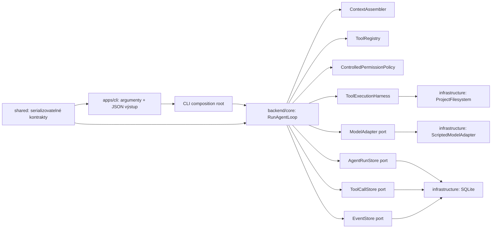

# R1 – interní headless agentní smyčka: návrhová specifikace

| Položka | Hodnota |
| --- | --- |
| Stav | Návrh k autorské kontrole |
| Datum | 23. srpna 2026 |
| Implementační krok | `R1 – interní headless/CLI agentní smyčka` |
| Produktová autorita | `PRD_v1.0.md` |
| Pořadí implementace | `docs/product/ROADMAP.md`, R1 |
| Rozsah a rizika | `docs/product/ETAPIZACE_v1.0.md`, začátek F1 |
| Technický základ | R0 v `main`, zejména event envelope v1, SQLite/WAL, core porty a dependency pravidla |

## 1. Cíl

R1 vytvoří první skutečnou, deterministickou agentní smyčku Codrynu. Interní
headless CLI přijme kořen fixture projektu, textové zadání a explicitní
referenci na soubor. Core sestaví omezený kontext, zavolá fake modelový adapter,
zpracuje několik read-only tool callů a vrátí pravdivý strukturovaný výsledek.

R1 ověřuje rozdělení odpovědností mezi adapter, orchestrátor, registry nástrojů,
permission policy a execution harness. CLI je pouze vstupní adaptér; stav,
pravidla smyčky, validace tool callů, oprávnění a audit vlastní backend.

## 2. Pozorovatelný výsledek

Z kořene repozitáře půjde spustit vestavěný scénář nad verzovaným fixture
projektem. Scénář:

1. přijme úkol a explicitní referenci na `README.md`;
2. sestaví první modelový kontext a zaznamená jeho zdroje bez duplikace obsahu
   do auditních eventů;
3. fake adapter požádá o omezené textové hledání;
4. po strukturovaném výsledku požádá o přečtení konkrétního souboru;
5. po druhém výsledku vrátí konečnou textovou odpověď;
6. CLI vypíše jediný validovaný JSON výsledek a skončí exit codem odpovídajícím
   stavu relace.

Stejný scénář musí desetkrát z deseti vytvořit shodnou posloupnost významových
eventů. Identifikátory a časy se mohou lišit; typy eventů, stavy, tool cally,
bezpečnostní rozhodnutí a konečný významový výsledek se lišit nesmějí.

## 3. Vědomě nezahrnutý rozsah

- zápis, patch, shell, testovací příkaz, diff, snapshot a návrat změn;
- produktové Electron UI nebo nové IPC kanály;
- reálný LLM provider, BYOK, streaming zobrazovaný uživateli a provider eval;
- strukturované otázky uživateli a čekající ruční oprávnění;
- TypeScript strukturální profil, repo mapa a `.codrynignore`;
- obnova rozpracované relace po pádu backendu;
- workspace revision, change set, verification record a koordinace relací;
- obecné použití CLI nad citlivým nebo neověřeným projektem jako podporovaný
  produktový tok.

Tyto oblasti patří do R2 až R4. R1 jim připraví kontrakty, ale nebude předstírat
jejich implementaci.

## 4. Zvolená architektura

R1 použije explicitní aplikační službu `RunAgentLoop` v `backend/core`.
Služba bude záviset pouze na portech pro model, perzistenci, čtení projektu,
hodiny a generování ID. Konkrétní SQLite, filesystem a fake adapter zůstanou v
`backend/infrastructure`.



Zamítnuté alternativy:

- čistě in-memory smyčka by nesplnila trvalou auditní stopu a přesunula by
  zásadní perzistenční návrh do R2;
- obecný workflow engine by přidal abstrakce, které R1 ani R2 nepotřebují;
- orchestrace v CLI by porušila hranici schválenou v R0 a později by se musela
  duplikovat pro Electron.

## 5. Struktura komponent

### 5.1 `apps/cli`

Vznikne privátní workspace `@codryn/cli`. Jeho odpovědnost je omezená na:

- validaci argumentů procesu;
- vytvoření composition rootu;
- předání jednoho `RunAgentRequest` do core služby;
- serializaci `RunAgentResult` na stdout;
- bezpečnou veřejnou chybu na stderr a stabilní exit code;
- převod `SIGINT` na `AbortSignal` pro běžící službu.

CLI nesmí importovat SQLite implementaci, filesystem tool implementace ani
pravidla smyčky přímo. Ty smí znát pouze composition root.

R1 podporuje přesně tyto argumenty:

```text
--project <absolute-path>
--task <non-empty-text>
--context <relative-path>       # lze opakovat, nejvýše 8 hodnot
--scenario read-search-summary # jediný vestavěný scénář R1
--max-steps <1..32>             # výchozí 8
--user-data-dir <absolute-path>
```

Neznámý argument, relativní project/user-data cesta, chybějící hodnota nebo
neplatný limit skončí před composition rootem exit codem `2`. Dokončená relace
vrací `0`; bezpečně ukončená nebo selhaná relace vrací `1`.

### 5.2 `RunAgentLoop`

`RunAgentLoop` je jediný zdroj pravdy pro živý stav běhu. Veřejný vstup a
výstup budou mít tento význam:

```ts
interface RunAgentRequest {
  readonly requestId: Uuid;
  readonly projectRoot: string;
  readonly task: string;
  readonly contextReferences: readonly string[];
  readonly maxSteps: number;
}

interface RunAgentResultBase {
  readonly schemaVersion: 1;
  readonly runId: Uuid;
  readonly stepCount: number;
  readonly verification: {
    readonly status: 'not_applicable';
    readonly reason: 'R1_READ_ONLY_RUN';
  };
}

type RunAgentResult = RunAgentResultBase & (
  | { readonly status: 'completed'; readonly finalText: string }
  | { readonly status: 'cancelled'; readonly failure: {
      readonly code: 'R1_CANCELLED'; readonly message: string
    } }
  | { readonly status: 'failed'; readonly failure: {
      readonly code: AgentRunFailureCode; readonly message: string
    } }
);
```

`RunAgentLoop.execute(request, signal)` provede smyčku sekvenčně. Jedním krokem
je jedno dokončené volání adapteru. Před zahájením dalšího volání zkontroluje,
zda `stepCount < maxSteps`; jinak relaci ukončí `STEP_LIMIT_EXCEEDED`. R1
nespouští dva modelové kroky ani dva tool cally souběžně.

### 5.3 Modelový kontrakt

Core definuje provider-neutral `ModelAdapter`:

```ts
interface ModelAdapter {
  readonly descriptor: ModelDescriptor;
  stream(
    request: ModelRequest,
    signal: AbortSignal
  ): AsyncIterable<ModelStreamEvent>;
}
```

`ModelDescriptor` obsahuje stabilní `adapterId`, `modelId` a capability profil
pro streaming, tool calling, structured output, image input, usage metadata,
context limit a compaction. Neznámá schopnost má stav `unknown`, nikoli `true`.

R1 zpracuje stream eventy `text_delta`, `tool_call`, `usage`, `completed` a
`failed`. Jedna dokončená odpověď smí obsahovat buď konečný text, nebo jeden či
více tool callů; kombinace konečného výsledku a tool callu je v R1 odmítnuta
jako `MODEL_RESPONSE_UNSUPPORTED`. Neznámý event nebo stream bez terminálního
eventu je normalizovaná chyba adapteru.

Model nikdy nedostane implementační objekt Zod schématu. Dostane JSON Schema
odvozené ze stejného Zod zdroje pravdy, který používá runtime validace.

### 5.4 Deterministický fake adapter

`ScriptedModelAdapter` bude infrastrukturní implementace bez sítě. Dostane
neměnný `FakeScenario` složený z očekávaných vstupů a odpovědí. Před vydáním
další odpovědi ověří:

- pořadí modelových tahů;
- identitu dostupných nástrojů a jejich verze;
- přítomnost požadovaných kontextových zdrojů;
- typ a bezpečný význam předchozího tool resultu.

Neshoda skončí `FAKE_SCENARIO_MISMATCH`; adapter nesmí improvizovat ani číst
fixture přímo. Vestavěný scénář bude definován v `apps/cli`, zatímco testy si
mohou sestavit vlastní scénáře proti stejnému adapteru.

### 5.5 Registry nástrojů a harness

`ToolRegistry` eviduje stabilní ID, verzi, popis, Zod vstupní a výstupní
schéma, rizikovou kategorii a handler. Registry pouze vyhledává definici a
validuje kontrakty. `ToolExecutionHarness` je samostatná služba, která:

1. přijme neověřený modelový tool call;
2. vyhledá přesnou kombinaci ID a verze;
3. validuje vstup bez významové auto-opravy;
4. získá rozhodnutí `ControlledPermissionPolicy`;
5. odmítnuté volání nespustí;
6. povolené volání předá handleru;
7. validuje výstup handleru;
8. vrátí normalizovaný bezpečný `ToolResult`.

Každý bod mění stav `ToolCall` pouze přes doménový přechod a zapisuje
odpovídající kanonický event. Opakování stejného modelového požadavku nevytváří
skryté znovuspuštění; nový pokus musí mít nové execution ID a vazbu na původní
call ID.

## 6. Stavové automaty

R1 sjednotí dosavadní zjednodušené R0 grafy s kanonickými stavy PRD.

`AgentRun`:

```text
idle
  -> preparing_context
  -> waiting_for_model
  -> executing_tool
  -> waiting_for_model
  -> completed | cancelled | failed
```

Graf bude obsahovat také budoucí stavy `waiting_for_user_input`,
`waiting_for_approval` a `verifying`, ale R1 do nich nevstoupí. Terminální stav
nemá odchozí přechod. `completed` není synonymum `verified`; R1 vždy vrací
`verification.status = not_applicable`.

`ToolCall`:

```text
received
  -> schema_validated | failed
schema_validated
  -> permission_decided | failed
permission_decided
  -> queued | denied
queued
  -> running | cancelled
running
  -> succeeded | failed | cancelled | timed_out
```

Neznámý nástroj a nevalidní argumenty skončí strukturovaným odmítnutím před
`running`; projekce použije terminální stav `failed` a event
`tool_call.rejected` s konkrétním validačním kódem. `denied` je vyhrazeno pro
validní call zamítnutý permission policy. Automaticky povolené read-only volání má explicitní permission event,
zdroj pravidla a důvod; absence dialogu neznamená absenci rozhodnutí.

## 7. Read-only nástroje

### 7.1 `file.read` verze 1

Vstup:

```ts
{
  path: string;       // neprázdná relativní cesta
  startLine?: number; // celé číslo >= 1, výchozí 1
  maxLines?: number;  // 1..400, výchozí 200
}
```

Výstup:

```ts
{
  path: string;
  content: string;
  startLine: number;
  endLine: number;
  totalLines: number;
  truncated: boolean;
  contentHash: string; // SHA-256 pozorovaného celého souboru
}
```

Soubor smí mít nejvýše 1 MiB a modelový obsah nejvýše 64 KiB UTF-8. Binární,
nevalidní UTF-8 nebo citlivě klasifikovaný soubor je odmítnut stabilním kódem.

### 7.2 `text.search` verze 1

R1 podporuje pouze doslovné, case-sensitive hledání. Regulární výrazy,
nahrazování a externí proces nejsou součástí R1.

Vstup:

```ts
{
  query: string;      // 1..512 znaků
  path?: string;      // relativní soubor nebo složka, výchozí "."
  maxResults?: number;// 1..100, výchozí 50
}
```

Výstup obsahuje seřazené shody `{ path, line, column, preview }`, příznak
`truncated` a počty prohledaných souborů a bytů. Jeden preview má nejvýše 400
znaků. Jedno volání projde nejvýše 500 regulárních souborů a 8 MiB textu.
Pořadí cest je lexikografické, aby byl výsledek reprodukovatelný.

### 7.3 Hranice projektu a citlivá data

Oba nástroje přijímají pouze relativní cestu bez NUL, absolutního prefixu a
segmentu `..`. Filesystem adapter získá kanonický `realpath` kořene i cíle a
odmítne cíl mimo kořen. Hledání nesleduje symlinky. Symlink souboru je povolen
jen tehdy, pokud jeho konečný cíl zůstane uvnitř kořene.

R1 vždy vynechá `.git`, `node_modules`, běžné build/cache adresáře, binární
soubory, `.env` varianty a známé názvy privátních klíčů či credential souborů.
Úplný parser `.codrynignore`, vysvětlení pravidel a jednorázové výjimky patří
do R4.

## 8. Context assembly

První `ModelRequest` obsahuje:

- uživatelský úkol;
- deklaraci dostupných nástrojů;
- projektový kořen pouze jako logickou identitu, nikoli osobní absolutní cestu;
- obsah explicitně uvedených referencí načtený přes stejný `ProjectFilesystem`
  port a stejné limity jako `file.read`;
- metadata každého zdroje: relativní cesta, SHA-256, počet bytů a důvod
  `explicit_reference`.

Nejvýše osm referencí smí dohromady dodat 128 KiB UTF-8. Překročení limitu,
duplicita po kanonizaci nebo zakázaná cesta ukončí sestavení kontextu konkrétní
chybou; reference se bez vysvětlení nevynechá.

Event `context.assembled` uchovává metadata a důvody zahrnutí, nikoli obsah
souborů. Následující modelové tahy dostávají předchozí normalizované modelové
odpovědi a tool resulty pouze v paměti běhu. Obnova této konverzace po pádu je
vědomě odložena do R2.

## 9. Oprávnění R1

Výchozí politika je Řízený režim. R1 má jedinou automaticky povolenou kategorii
`read_project` a pravidlo `R1_SAFE_READ_WITHIN_PROJECT`. Povolení platí jen pro
validovaný vstup uvnitř otevřeného kořene a po kontrole citlivé cesty.

Každé rozhodnutí obsahuje tool call ID, výsledek `allowed_by_rule | denied`,
zdroj pravidla a bezpečný důvod. Požadavek mimo kořen, citlivá cesta nebo
neznámá riziková kategorie je tvrdě odmítnuta. R1 nevytváří čekající
`PermissionRequest`, protože neobsahuje akci vyžadující interaktivní souhlas.

## 10. Události a audit

R1 zachová `EventEnvelope` verze 1. Core je producentem kanonických eventů;
CLI, adapter ani filesystem nezapisují do databáze přímo. Minimální katalog:

- `agent_run.created`;
- `agent_run.state_changed`;
- `context.assembled`;
- `model.requested`;
- `model.response_received`;
- `model.failed`;
- `tool_call.received`;
- `tool_call.schema_validated`;
- `tool_call.permission_decided`;
- `tool_call.queued`;
- `tool_call.started`;
- `tool_call.succeeded`;
- `tool_call.rejected`;
- `tool_call.failed`;
- `agent_run.completed`;
- `agent_run.cancelled`;
- `agent_run.failed`.

Payload ukládá identity, stavy, verze, relativní cesty, délky, hashe, trvání,
bezpečné kódy a zkrácený preview. Neukládá API klíče, procesní prostředí,
osobní absolutní kořeny ani plný obsah přečtených souborů. Každý stavový
přechod a jeho event se uloží atomicky.

## 11. SQLite evoluce

R1 nebude vydávat `diagnostic_sessions` za agentní relace. Migrace verze 2
zavede společný kořen `sessions` a zachová R0 data:

```text
sessions
  id, kind, created_at, updated_at

diagnostic_sessions
  session_id -> sessions.id, status

agent_runs
  session_id -> sessions.id, request_id, state, task,
  max_steps, step_count, adapter_id, model_id, failure_code

tool_calls
  id, run_id -> agent_runs.session_id, parent_call_id,
  tool_id, tool_version, state, arguments_json,
  permission_result, safe_result_json, error_code,
  created_at, updated_at

events
  stávající event envelope, session_id -> sessions.id
```

Migrace v jedné transakci:

1. vytvoří `sessions`;
2. zkopíruje identity a časy existujících diagnostických relací;
3. přestaví `diagnostic_sessions` s cizím klíčem na `sessions`;
4. přestaví `events` bez změny event ID, sekvence, obálky nebo payloadu;
5. vytvoří `agent_runs`, `tool_calls` a potřebné indexy;
6. ověří foreign keys a zachování počtů i obsahu R0 fixture.

`AgentRunStore` poskytne atomické vytvoření relace s počátečním eventem a
atomický stavový přechod s eventem. `ToolCallStore` poskytne stejný princip pro
tool call. Oba používají jednu otevřenou SQLite connection sestavenou v
composition rootu. Event store zůstává společný pro R0 i R1.

## 12. Chyby a ukončení

Veřejné kódy R1 budou stabilní a bez raw výjimky:

- `R1_INPUT_INVALID`;
- `R1_CONTEXT_REFERENCE_INVALID`;
- `R1_CONTEXT_LIMIT_EXCEEDED`;
- `R1_MODEL_CAPABILITY_MISSING`;
- `R1_MODEL_ADAPTER_FAILED`;
- `R1_MODEL_RESPONSE_UNSUPPORTED`;
- `R1_FAKE_SCENARIO_MISMATCH`;
- `R1_TOOL_UNKNOWN`;
- `R1_TOOL_INPUT_INVALID`;
- `R1_TOOL_PERMISSION_DENIED`;
- `R1_TOOL_OUTPUT_INVALID`;
- `R1_TOOL_EXECUTION_FAILED`;
- `R1_STEP_LIMIT_EXCEEDED`;
- `R1_CANCELLED`;
- `R1_PERSISTENCE_FAILED`;
- `R1_INTERNAL_ERROR`.

Neznámý nástroj a neplatné argumenty vytvoří normalizovaný chybový tool result,
který adapter může v dalším kroku opravit; implementace nástroje se nespustí.
Nepodporovaný modelový výstup, porucha perzistence a porušení stavového
invariantu ukončí relaci jako `failed`. Abort signal ukončí právě probíhající
adapter nebo read-only handler a relaci převede do `cancelled`, až když core
potvrdí, že neběží další operace.

Neočekávaná interní výjimka se zapíše pouze do redigovaného backendového logu.
CLI dostane pevnou veřejnou zprávu bez stacku a absolutních osobních cest.

## 13. Vestavěný fixture a scénář

Verzovaný fixture `tests/support/fixtures/r1-project` bude malý TypeScript
projekt s `README.md`, několika zdrojovými soubory a symbolem použitým na více
místech. Neobsahuje instalované závislosti, síťový remote ani tajemství.

Scénář `read-search-summary`:

1. ověří explicitní kontext `README.md`;
2. vydá `text.search@1` pro připravený symbol;
3. ověří seřazené shody;
4. vydá `file.read@1` pro soubor s definicí;
5. ověří hash a očekávaný význam obsahu;
6. vrátí pevný český souhrn odpovídající fixture.

Fixture je důkaz harnessu, ne produktová ukázka inteligence modelu. Fake
adapter bude v CLI i dokumentaci vždy pojmenován jako deterministický provider
double, tedy řízená náhrada poskytovatele pro opakovatelné testování.

## 14. Testovací strategie

### 14.1 Unit testy

- všechny nové povolené a důležité zakázané přechody `AgentRun` a `ToolCall`;
- terminální stavy bez odchozích přechodů;
- limit kroků včetně hranic 1 a 32;
- registrace duplicitního ID/verze, neznámý nástroj a nevalidní argumenty;
- permission decision pro povolenou a zakázanou cestu;
- skládání modelového streamu a odmítnutí neznámého či nedokončeného streamu;
- fake scénář se shodou i neshodou;
- kontextové limity a audit metadata bez obsahu.

### 14.2 Integrační testy

- migrace naplněné R0 databáze na verzi 2 bez ztráty relace nebo eventu;
- opakované spuštění migrace jako no-op a checksum mismatch jako tvrdá chyba;
- atomické vytvoření a přechod agentního běhu s eventem;
- atomický životní cyklus tool callu s eventy;
- `file.read` uvnitř kořene, line range, truncation, binární vstup a symlink
  dovnitř i ven;
- `text.search` deterministické pořadí, limity shod, souborů a bytů;
- výchozí odmítnutí citlivých cest;
- zrušení čekajícího fake adapteru přes AbortSignal.

### 14.3 Kontraktní a architektonické testy

- validní a nevalidní `RunAgentRequest`, `RunAgentResult`, modelové eventy a
  tool resulty;
- stejná kontraktní sada pro fake adapter a budoucí adaptery bez požadavku na
  síť;
- `apps/cli` bez importu interních modulů infrastruktury mimo composition root;
- `backend/core` bez `node:fs`, `node:sqlite`, Electronu a procesních API;
- produkční kód bez importu `tests/support`;
- kontrola, že registry a harness jsou samostatné jednotky.

### 14.4 End-to-end acceptance

- úspěšný vestavěný scénář desetkrát z deseti;
- významově shodná stopa eventů všech deseti běhů;
- neznámý nástroj a nevalidní argumenty bez volání handleru;
- řízené ukončení při limitu kroků;
- normalizované selhání fake adapteru;
- CLI exit codes a JSON výstup bez osobní absolutní cesty;
- stávající R0 suite, package a packaged smoke bez regrese.

## 15. Ověřovací příkaz R1

Kořenový skript `verify:r1` spustí v tomto pořadí a zastaví se při první chybě:

```text
npm run typecheck
npm run lint
npm run check:deps
npm test
npm run test:r1-repeatability
npm run package
node scripts/verify-packaged-r0.mjs
```

R1 nemění produktové Electron UI, ale musí dokazovat, že rozšíření databáze a
shared/core kontraktů neporušilo zabalený R0 smoke. `npm run make` zůstane
součástí úplné release kontroly; pro běžnou R1 bránu není nutné při každé malé
změně vytvářet instalátor.

## 16. Implementační pořadí

Detailní plán rozdělí R1 na malé testovatelné celky v tomto pořadí:

1. sdílené R1 kontrakty a rozšířené stavové automaty;
2. migrace obecné relace a agentní/tool persistence;
3. provider-neutral modelový kontrakt a scripted fake adapter;
4. project filesystem a context assembly;
5. registry, controlled policy a read-only harness;
6. `RunAgentLoop` a chybové scénáře;
7. tenký CLI workspace a composition root;
8. verzovaný fixture, desetiběhová acceptance a `verify:r1`;
9. architektonická dokumentace, ADR změny persistence a autorský checklist.

Každý celek vznikne test-first, skončí relevantními kontrolami a samostatným
commitem. Implementační plán určí přesné soubory, rozhraní, testy a příkazy.

## 17. Dokončovací brána

R1 je dokončeno pouze tehdy, když:

1. `npm ci` funguje s předepsaným Node 24.19.0 a npm 11.x;
2. typecheck, lint, dependency pravidla a úplná testovací sada projdou;
3. read-only referenční úkol projde desetkrát z deseti;
4. každé spuštění má auditovatelnou a významově shodnou stopu;
5. neznámý nebo nevalidní tool call nikdy nespustí handler;
6. limit kroků, porucha adapteru a zrušení skončí pravdivým terminálním stavem;
7. filesystem nástroje neuniknou mimo kořen ani přes symlink;
8. R0 diagnostika, SQLite důkazy a packaged smoke zůstávají funkční;
9. CLI obsahuje pouze vstupní, výstupní a composition odpovědnost;
10. žádný výsledek R1 není prezentován jako ověřená změna projektu.

Selhání kterékoliv povinné položky blokuje přechod na R2.

## 18. Porozumění autora

Před uzavřením R1 autor vlastními slovy vysvětlí:

1. rozdíl mezi modelovým adapterem, orchestrátorem, registrem a harnessem;
2. proč fake adapter testuje skutečný harness, i když nenahrazuje live model;
3. proč CLI nesmí vlastnit agentní pravidla;
4. co přesně tvoří jeden krok a proč existuje limit;
5. kdy je tool call validovaný, povolený a skutečně spuštěný;
6. proč automaticky povolené čtení stále potřebuje audit oprávnění;
7. jak realpath kontrola brání úniku přes symlink;
8. proč event log neukládá plný obsah přečtených souborů;
9. proč R1 `completed` neznamená `verified`;
10. jak migrace zachová R0 data a proč agentní běh není diagnostická relace;
11. proč se významová determinističnost porovnává bez UUID a časů;
12. které konkrétní hranice musí zůstat stabilní pro R2.

## 19. Návaznost na R2

R2 rozšíří stejný orchestrátor a harness o cílený patch, expected hash,
omezený shell/test, skutečné čekající oprávnění, Git/non-Git obnovovací bod,
verification record, workspace revision a bezpečný návrat. R2 nesmí zavést
druhou agentní smyčku ani obejít R1 registry, permission audit nebo event log.
